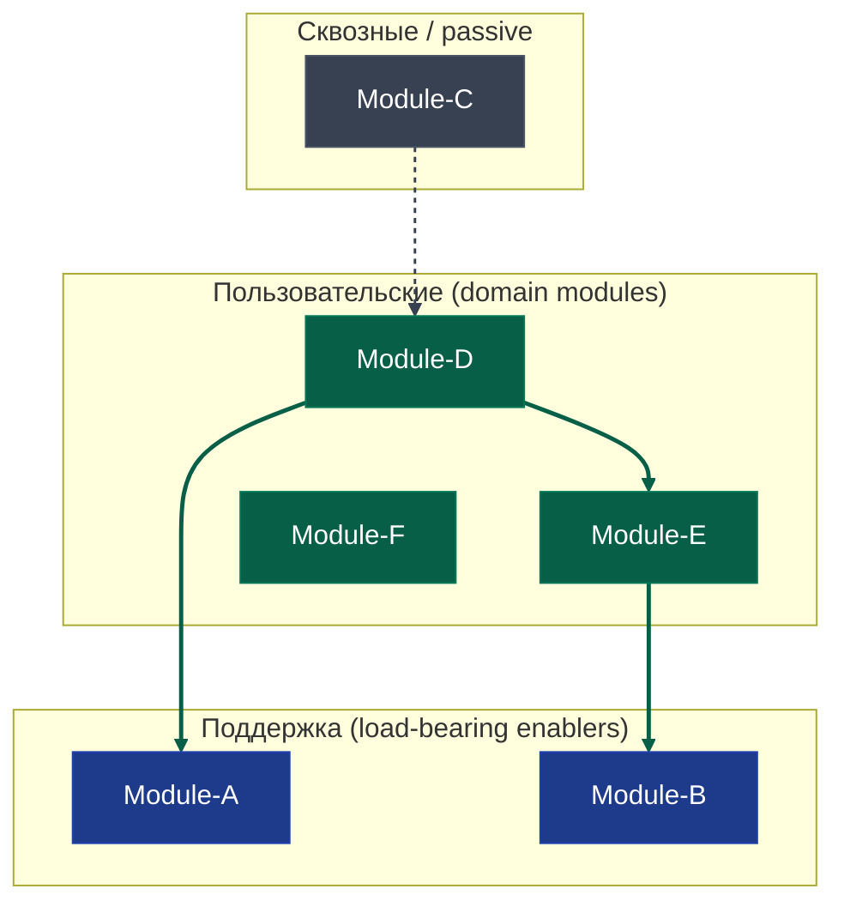

# `hi_flow:product-spec` v0.5.0 — Feedback Iteration Amendment

**Status:** draft
**Date:** 2026-05-25
**Type:** amendment к design spec 2026-05-10
**Source:** `hi_flow-product-spec-feedback.md` (REH ERP first iteration session, 2026-05-25)
**Original design spec:** `docs/superpowers/specs/2026-05-10-hi_flow-product-spec-design.md`

---

## Context

Скилл v0.4.0 прошёл первую боевую сессию (REH ERP / comm-core-plus-demos, 33 функции, 13 модулей). Накоплены 8 пунктов замечаний + 1 положительный отзыв. Amendment фиксирует **три High Priority изменения**, требующие нового rationale или amendment к существующим D-решениям. Остальные пункты — точечные правки в SKILL.md / templates без нового дизайна.

**Out of scope amendment'а** (точечные правки Фазы 2, не требуют дизайн-фиксации):

- Pivot guidance при перестройке module map (Low, §5 feedback).
- Premortem без дельты — explicit case (Low, §6 feedback).
- TOC + 1-2 строки summary в начале каждого модуля (Medium, §4 feedback).
- Backlog `§ Shipped features` → `§ Committed features` + tag `[committed iterN]` (Low, §7 feedback).
- Mid-session feedback hooks для самого скилла — **выпало** per operator decision: feedback к скиллу собирается только при явной просьбе оператора, без автоматических hooks.

Положительный отзыв (feedback §9) — отдельная фиксация в implementation report по итогам Фазы 2; в этой спеке не дублируется.

---

## A1. Step 5 Visibility & Structured Gate

### Проблема (feedback §1)

Шаг 5 спроектирован как «agent тихо применяет probe-таблицу D9 selectively и выдаёт результат». Это слишком implicit для оператора:

- Не видит какие probes были применены, какие пропущены и почему.
- Не видит какие ответы агент presumed за него по контексту.
- Не видит где есть выборы, которые нужно подтвердить явно.

Конкретное проявление REH ERP сессии: агент выкатил 11 enabler'ов «готовым продуктом» с молчаливыми дефолтами (registration mode, password reset механика, audit log scope, in-app push). Оператор воспринял как «у тебя вопросов нет» и спросил «правильно ли понял».

**Корень.** Текущая selectivity-формулировка (SKILL.md строки 197-230) разрешает скиллу самому решать какие probes применять, но не накладывает требования показать оператору **что именно** скилл за оператора решил. В результате selectivity деградирует в silent default — что глобальный принцип 5 «Fallback-на-дефолт молча запрещён» прямо запрещает.

### Дизайн

Три добавления к Шагу 5.

**Sub-step 0 — Operator-facing explanation + visibility пропущенных probes в начале Шага 5.**

Перед запуском probes скилл говорит оператору две вещи (точные формулировки — гайды, агент адаптирует под контекст):

**Часть 1 — explanation процесса:**

> *«Сейчас по каждой пользовательской функции пройдусь по списку продуктовых вопросов про инфраструктуру (учётки, права, нотификации, поиск, журнал действий, восстановление пароля, multi-tenancy, экспорт). По каждому вопросу три сценария: если ответ очевиден из контекста — приму дефолт и явно покажу его как «дефолт: X, альтернатива: Y, подтверждаешь?»; если ответ неочевиден или есть несколько разумных вариантов — спрошу тебя; если вопрос не применим к этому продукту по моему контексту — пропущу, но скажу об этом сейчас (см. ниже).»*

**Часть 2 — explicit visibility пропущенных probes (закрывает silent skip):**

> *«Из 8 областей probes в этом продукте по моему контексту не применимы: <список с причиной за каждую>. Например: multi-tenancy — single-customer demo; audit log — нейтральный домен без compliance требований; экспорт — нет внешних потребителей данных. Если что-то из этого ты хочешь обсудить явно — скажи сейчас, до запуска probes.»*

Это закрывает основной gap фидбека §1: оператор видит **не только** что предложено, **но и** что не обсуждается. Probes, помеченные «не применимы» здесь — не появляются в выводе Шага 5 (нет дефолта, нет enabler'а). Probes, по которым оператор поднял возражение — добавляются обратно в список и обрабатываются как обычные probes.

Цель — оператор знает что сейчас происходит, что от него ожидается, и что не будет обсуждаться, до того как поток probes начался.

**Sub-step 1 modification — обязательное правило visible defaults.**

Существующее правило selectivity (probe-таблица D9 применяется selectively) сохраняется. К нему добавляется visibility constraint:

> *«Когда скилл presumes ответ на probe — relevant, но дефолт очевиден из контекста — он обязан показать дефолт оператору как `(дефолт: X; альтернатива: Y; подтверждаешь?)` в момент применения дефолта. Молчаливый дефолт запрещён.*
>
> *Probe не задавать ≠ probe пропустить молча. Probe пропускается без visibility только если она не сработала по триггеру (например, multi-tenancy probe в single-customer демо, audit log probe в нейтральном домене) — тогда её просто нет в списке для этой функции, нечего и показывать.»*

**Sub-step 6 (новый) — Structured review block в конце Шага 5.**

После прохождения probes по всем domain-функциям и формирования полного списка enabler'ов — скилл показывает оператору structured review block:

```
Шаг 5 завершён. Выведено N поддерживающих функций. По каждой — ключевые решения:

| ID       | Название            | Ключевые решения                                          | Источник           | Действие                                  |
|----------|---------------------|-----------------------------------------------------------|--------------------|-------------------------------------------|
| F-id-1   | Учётные записи       | самостоятельная регистрация; magic-link reset             | дефолт             | подтвердить / обсудить / альтернатива     |
| F-id-2   | Права доступа        | плоские роли admin/user/viewer (admin + 2 уровня)         | обсуждение в Шаге 5| подтверждено / переоткрыть                |
| F-notif-1| Нотификации          | email-канал; нет in-app push                              | дефолт             | подтвердить / обсудить / альтернатива     |
| ...      | ...                 | ...                                                       | ...                | ...                                       |

Пропущены целиком (визибилити skipped probes — повтор из Sub-step 0):
- multi-tenancy probe — single-customer demo
- audit log probe — нейтральный домен

По каждой строке — твоё решение перед переходом к Шагу 6.
```

Колонки:
- **Источник** — `дефолт` (presumed default) или `обсуждение в Шаге 5` (probe задана как вопрос, оператор ответил).
- **Действие** — для строки `Источник = дефолт`: «подтвердить / обсудить / альтернатива». Для строки `Источник = обсуждение`: «подтверждено / переоткрыть» (другой выбор — повторный probe).
- **Пропущенные probes** — повтор из Sub-step 0, чтобы оператор видел их и при review (не только в начале).

Свободная форма «возражаешь?» запрещена. Только structured presentation. Если оператор подтверждает все одним «подтверждаю всё» — валидно, но скилл сначала показывает таблицу.

**Recovery loop при «обсудить» / «альтернатива» / «переоткрыть».**

Скилл возвращается к probe этого enabler'а с уточняющим вопросом. После резолва — обновляет строку таблицы и продолжает по остальным.

**Если в ходе recovery появляется новый enabler** (например, оператор отвечает «нет, нужна не плоская модель, а иерархическая с inheritance» → новый F-id-3 «Иерархические permissions»):

1. К новому enabler'у применяются **тесты D2** (атомарность / отгружаемость / переговариваемость) — как к обычной enabler-функции из Шага 5.
2. К новому enabler'у применяется **полный probe-блок Шага 5** с теми же visible defaults / гейтами.
3. **Module assignment** — новый enabler получает module-slug (обычно из существующих модулей; если требуется новый модуль — возврат к Module assignment после Шага 4 с пересмотром списка).
4. Новый enabler добавляется в таблицу sub-step 6 как новая строка, **источник = `обсуждение в Шаге 5`**.

**Maximum cascade depth = 2.** Если probe нового enabler'а порождает ещё один новый enabler — оба добавляются. Третий уровень cascade (новый enabler из probe-обсуждения нового enabler'а) **запрещён в одном Шаге 5**. Если оператор хочет добавить третий уровень — это сигнал что scope взрывается; скилл говорит «достигнут предел вглубь Шага 5, новые enabler'ы требуют отдельного прохода. Останавливаемся, фиксируем текущий список, в Шаге 12.2 проверка целостности подсветит если что-то требует return в Шаги 4-5».

### Затрагивает D-решения

- **D9 (probing taxonomy) — amendment.** Добавляется правило visible defaults и structured гейт; существующее правило selectivity сохраняется без изменений, но дополняется visibility constraint. Привязка к глобальному принципу 5 (silent fallback запрещён) теперь явная.

### Implementation impact

- SKILL.md Шаг 5 procedure (строки 197-230): три добавления (sub-step 0, modification sub-step 1, новый sub-step 6).
- product-spec-template.md — не затрагивает напрямую (структура спеки не меняется).

---

## A2. Jargon Translation Rule

### Проблема (feedback §2)

Внутренние идентификаторы дизайна скилла протекают в общение с оператором: `D9`, `D2 atomic`, `D5 boundary test`, `D17 asymmetric pointers`, `D18 frozen invariant`, `CCP1/2/3`, `Sf`, `CC`, `probe-таблица`, `shippability`, `atomicity`, `negotiability`, `atomic user job`.

Оператор (автор скилла!) в REH ERP сессии явно попросил «давай не использовать жаргон» и «что такое atomic — поясни». Если автор не парсит свой собственный жаргон в продакшен-режиме, новый пользователь точно не парсит.

**Корень.** D4 (plain language principle) и P1 (аудитория артефактов — продуктолог, не инженер) фиксируют общее правило, но целились в инженерный жаргон извне (throughput, payload, idempotency). Собственный жаргон скилла туда не попадал — D-references выглядят «технически нужными для traceability», и агент не воспринимает их как жаргон. На practice они и есть жаргон — без контекста дизайн-спеки не парсятся.

### Дизайн

Новый Operational Rule в SKILL.md, фиксирующий разделение **internal reasoning** vs **operator-facing communication**.

**Формулировка нового правила:**

> **Operational Rule 11. Жаргон скилла остаётся внутри скилла.**
>
> Внутренние идентификаторы дизайна (D-N решений, CCP-N сквозных проверок, P-N принципов проекта, atomic / shippability / negotiability как термины, probe-таблица, P-NAME подполитики, Sf-N развилки) **и кальки с английского** (`enabler`, `domain feature`, `scaffolding`, `cardinality tag`) используются скиллом для внутренних рассуждений и cross-references в собственных артефактах (design spec, implementation reports, ARCHITECTURE.md). В **operator-facing** общении в ходе сессии — переводятся в продуктовый русский.
>
> **Таблица перевода (расширенная):**
>
> | Внутреннее | Operator-facing |
> |------------|------------------|
> | **D-N дизайн-решения** | |
> | D1 trinity функций (domain / enabler / scaffolding) | три типа функций: пользовательские, поддерживающие, инженерные |
> | D2 three-test gate | три проверки кандидата в функцию: атомарность / отгружаемость / переговариваемость |
> | D3 module = кластер, не уровень иерархии | модуль — это группировка родственных функций, не отдельный уровень |
> | D4 plain language principle | принцип «спека для продуктолога, не для инженера» |
> | D5 boundary test | проверка границ стратегической развилки (меняет состав функций или связи?) |
> | D6 per-feature granularity | формат карточки на каждую функцию |
> | D8 feedback loop | связь продуктовой и фича-спеки через update mode |
> | D9 / probe-таблица | список продуктовых вопросов про инфраструктуру |
> | D14 update mode mechanics | режим обновления активной спеки |
> | D15 update mode trigger | автообнаружение активной спеки при старте |
> | D16 one spec = one iteration | одна спека = одна отгружаемая итерация |
> | D17 asymmetric pointers | дисциплина указателей в бэклоге |
> | D18 frozen invariant | спека после подписания не редактируется |
> | **Project-specific principles** | |
> | P1 (аудитория артефактов) | артефакт для продуктолога, не для инженера |
> | P6 (escalation discipline) | дисциплина обращения к оператору |
> | **Сквозные проверки** | |
> | CCP1 | сквозная проверка нечётких критериев («быстро» / «много» / «опасный») |
> | CCP2 | сквозная проверка противоречий с уже записанным |
> | CCP3 | сквозная классификация развилок (стратегическая или фичевого уровня) |
> | **Термины проверок D2** | |
> | atomicity / atomic user job | проверка атомарности — одна пользовательская задача на функцию |
> | shippability | проверка отгружаемости — даст ли value, если отгрузить только это |
> | negotiability | проверка переговариваемости — осмысленен ли вопрос «делаем X или нет» |
> | **Кальки с английского** | |
> | enabler / enabler feature | поддерживающая функция |
> | domain feature | пользовательская функция |
> | scaffolding | инженерное решение без продуктовых развилок |
> | premortem | завершающая проверка «что пойдёт не так» |
>
> **Исключения** (остаются как есть в operator-facing):
> - **ID функций** (`F-id-1`, `F-comm-1`) — стабильные идентификаторы, оператор пользуется ими сам при cross-references. Не переводятся.
> - **ID развилок** (`Sf1`, `Sf2`) и **ID политик** (`CC1`, `CC2`) — те же стабильные идентификаторы, остаются.
> - **Cardinality tags** (`XOR` / `OR` / `OPT` на развилках) — формальные операторы логики, остаются. Раскрытие при первом использовании в спеке («XOR = выбрать одну ветку из взаимоисключающих», «OR = одну или несколько», «OPT = опционально, можно ни одной»).
> - **Статусы спеки** (`draft` / `signed` / `shipped`) — operator-facing метаданные, остаются как есть.
> - **Если оператор спрашивает напрямую про дизайн скилла** («что такое D9 в твоей логике?») — скилл может ссылаться на D-N как на дизайн-маркер, но обязан раскрыть содержание плэйн-языком первым предложением.
>
> **Mirror-режим оператора.** Если оператор сам использует internal термин в своей реплике (например, «давай заглянем в D9» — характерно для оператора-автора скилла) — скилл может **mirror** тот же термин в своём ответе, но **всегда** раскрывает его plain-эквивалентом в первой реплике той сессии: «D9 = список продуктовых вопросов про инфраструктуру; смотрим». Silent mirror запрещён — нарушает D4 для будущих пользователей не-авторов.
>
> **Универсальное правило для терминов вне таблицы.** Если в operator-facing блоке всплывает внутренний термин, не покрытый таблицей — скилл **переводит через короткое описание-«как для нового оператора»**, не оставляет как есть. Таблица — минимум, не исчерпывающий список.

**Распространение принципа на финальную спеку.**

Принцип применяется не только к интерактивной коммуникации, но и к контенту, который скилл пишет в `product-spec.md` и `product-backlog.md`. ID функций / развилок / политик остаются. Но в **текстах внутри полей** карточек (Назначение / Входит / Не входит / Не делаем вообще) — никаких «D9-derived», «atomic», «shippability» терминов. Содержательно те же проверки описываются плэйн-языком.

**Контроль соответствия.**

Гештальт-просмотр готового вывода оператору перед отправкой: читается как русский с естественными вкраплениями (MVP, API, UX) или как мешанина с D-маркерами и калькированными англицизмами? Если кластеризуются ≥2 внутренних терминов в одном сообщении — переписать. Если в одном предложении ≥2 калькированных англицизмов рядом с русскими эквивалентами — переписать.

### Затрагивает D-решения

- **D4 (plain language principle) — уточнение scope.** D4 фиксирует «продуктовый русский в артефактах». Новое правило — конкретизация D4 на собственный жаргон скилла, который не покрывался изначальной формулировкой (D4 целил в инженерный жаргон извне типа throughput / payload).
- **P1 (аудитория артефактов — продуктолог, не инженер) — расширение scope.** P1 фокусировался на артефакты-output. Правило расширяется на operator-facing communication в ходе всей сессии.

### Implementation impact

- SKILL.md — новый Operational Rule 11.
- SKILL.md — pass по тексту: identify operator-facing блоки (формулировки вопросов оператору, объяснения дефолтов, сводные таблицы, completion messages) и translate D-references внутри них.
- Не затрагивает structure templates напрямую, но влияет на content генерации в карточках финальной спеки.

---

## A3. Module-Level Mermaid

### Проблема (feedback §8)

Mermaid в Section 4 потребовал **5 итераций** доработки в REH ERP сессии:

1. **Function-level** со всеми 33 функциями — silent fail в Markdown viewer.
2. **Fix синтаксиса** (quoted labels, ASCII edges) — всё равно не отрендерился, 30+ нод выходят за дефолтный limit рендерера.
3. **Упрощение до module-level** (13 нод) — отрендерился, но flat layout, все стрелки белые тонкие, нет визуальной иерархии enabler vs domain.
4. **Subgraphs + classDef** per группа модулей — лучше, но стрелки всё ещё одного типа, центр графа путается.
5. **linkStyle** цвета per source-group + увеличенная толщина — финальное состояние, ОК.

Проблема **двойная**:

- **Технически.** Синтаксис и сложность ломают рендеринг. Default Mermaid renderer не вытягивает 30+ нод; дефисы в node ID ломают парсер (`F-id-1` парсится как `F` минус `id-1`); кириллические edge labels не парсятся в части viewer'ов.
- **Концептуально.** Function-level (33 функции, ~50 edges) — неправильный уровень визуализации для product-spec, даже если бы отрендерился. Слишком много нод, теряется обзор. Module-level — правильный уровень для product-spec.

**Корень.** Текущая инструкция (Operational Rule 8) — «Mermaid обязателен, регенерация LLM'ом при изменении поля `Зависит от` в карточках, источник истины — `Зависит от`». Это implicit function-level: поле `Зависит от` живёт на function-level, граф из него — overload концептуально и не рендерится технически. Явного D-решения про уровень визуализации не было — фиксируем сейчас.

### Дизайн

**Operational Rule 8 переписывается с function-level на module-level.**

Текущая формулировка (SKILL.md строка 619):

> «**Mermaid обязателен в Section 4.** Регенерация LLM'ом при каждом изменении поля `Зависит от` в карточках. Источник истины — поле `Зависит от` в карточках.»

Новая формулировка:

> «**Mermaid в Section 4 — module-level, обязателен.**
>
> Ноды графа = модули (Identity, Communication, Sales и т.п.), связи = обобщения inter-module dependencies, выведенные из поля `Зависит от` в карточках функций. Function-level Mermaid out — даже при успешном рендере не работает как граф для product-spec (33+ нод теряют обзорность; module-level — правильный уровень обзора для продуктового артефакта).
>
> Источник истины — module assignment (после Шага 4) + поле `Зависит от` в карточках функций. Регенерация LLM'ом при изменении модулей или inter-module deps.
>
> **Алгоритм mapping function-level deps → module-level edges:**
> 1. Для каждой пары модулей (A, B), где A ≠ B: проверить, существует ли в спеке ≥1 функция модуля A, у которой в поле `Зависит от` указана ≥1 функция модуля B.
> 2. Если да → добавить **один** edge `A → B` в граф (не один на каждую function-dep — дедуплицируется до module-level).
> 3. **Тип edge** определяется характером зависимостей:
>    - Если ≥1 функция-источник имеет active dependency (использует поведение / данные модуля B при работе) → solid arrow (`A --> B`).
>    - Если **все** зависимости — passive policy application (модуль B применяет сквозную политику CC к модулю A, оператор использования не активен) → dashed arrow (`A -.-> B`).
> 4. **Edge labels пусты по умолчанию.** Если оператор хочет семантику связи — выносится в текстовый paragraph под Mermaid'ом («Communication использует Identity для проверки прав на send»), не в edge label (см. syntax guarantees).
>
> **Splitting при >25 модулях в спеке (большие продукты):**
> 1. Использовать категориальную группировку (Infra / Passive / Domain — см. категории ниже) в subgraph wrappers, оставляя ноды на module-level — обычно достаточно, потому что внутри subgraph модулей не больше 6-8.
> 2. Если внутри одной категории ≥4 модулей с тонкими взаимосвязями (вторичные связи между ними не критичны для product-level overview) — объединить в **supermodule** (одна нода с агрегированным именем «Sales cluster: Pipeline + Quotes + Contracts + Invoices»). Связи к supermodule аналогично — один edge на категорию.
> 3. Если даже категориальная группировка + supermodule не вмещается в 25 нод — выделить второй module-level граф для отдельного flow (см. опциональный second graph ниже).
> 4. Traceability при объединении в supermodule — комментарий под графом: «Sales cluster = F-sales-*, F-quote-*, F-contract-*, F-invoice-* (см. карточки в Section 4)». Поле `Зависит от` в карточках остаётся на module-level, не агрегируется.
>
> **Порядок при коллизии splitting × расщепление категории.** Если в одной спеке одновременно срабатывают триггеры расщепления категории на под-группы (продуктовая семантика) и supermodule-компрессии (≥4 модулей с тонкими взаимосвязями) — **расщепление применяется первым** (отражает продуктовую семантику), supermodule — внутри получившейся под-группы (механическая компрессия для рендеринга). Комбинация допустима; внутри расщеплённой под-группы supermodule выглядит как одна агрегированная нода с тем же стилем, что и под-группа.»

**Pre-baked skeleton в product-spec-template.md.**

Готовый шаблон с placeholder'ами для имён модулей и связей. Агент **наполняет** шаблон, не изобретает структуру с нуля:



**Универсальные категории групп (default — 3):**

- **Infra (load-bearing enablers)** — модули, от которых зависит большинство domain-модулей. Identity (учётки + права), Permissions, Tenancy. Универсальная категория — есть в любом нетривиальном продукте с пользователями.
- **Passive (cross-cutting)** — модули реализующие сквозные политики через все остальные. Audit log, Notifications hub (если централизованный), Reporting. Универсальная категория — есть в большинстве продуктов с историей действий или нотификациями.
- **Domain (пользовательские модули)** — модули с прямым user-facing value. Communication, Sales, Contacts, Inventory, и т.п. По умолчанию **одна группа**, без внутреннего разделения.

Пустую группу можно опустить целиком — например, в личном продукте без сквозных политик нет Passive; в очень маленьком продукте без enabler'ов нет Infra (редкий случай).

**Категория модуля — product-relative, не absolute.**

Один и тот же модуль (Identity, Permissions) в разных продуктах может попасть в разные категории. В стандартном end-product (CRM, ERP, личный трекер) Identity — это Infra, потому что обслуживает domain-функции. В **infrastructure-spec** (платформа auth для нескольких продуктов; permissions-as-a-service; identity provider) тот же Identity сам становится Domain — он и есть продукт. В таком кейсе Infra может оказаться пустой (если ниже Identity нет ещё одного слоя), а Domain содержит то, что в end-product'е считалось бы enabler'ами. Категория определяется ролью модуля **в этом продукте**, не absolute классификацией.

**Эвристика классификации (для module assignment после Шага 4).**

Скилл определяет категорию каждого модуля по его продуктовой роли в спекаемом продукте:

- **Domain** — модуль реализует core value proposition этого продукта. То, ради чего пользователь приходит. То, что описано в Section 1 (Описание продукта) и Section 3 (Задачи пользователей) как user-facing задачи.
- **Infra** — модуль load-bearing для domain-модулей: domain-функции **используют его поведение** (auth check, permission lookup, tenant resolution) для своей работы. Сам value пользователю не даёт, но без него domain не работает.
- **Passive** — модуль реализует сквозную политику поверх остальных (audit log применяется ко всем mutating actions; notifications hub слушает события всех модулей). Cross-cutting concern, не вызывается явно из domain-функций, а активируется на их события.

Классификация — **LLM-суждение** скилла на основе Section 1-3 + содержания карточек функций. **При неоднозначности** (модуль мог бы быть Infra или Domain — типичный hybrid-кейс) скилл предлагает классификацию оператору одной репликой: «*Identity модуль — в этом продукте классифицирую как [Infra / Domain] потому что [reasoning]. Подтверждаешь или переклассифицировать?*». Оператор подтверждает или переопределяет.

**Hybrid product (модуль с двумя ролями одновременно).**

Существуют продукты, где один и тот же модуль играет обе роли: CRM с public auth API (Identity — Infra для собственного CRM + Domain для внешних API-потребителей); SaaS, у которого identity-слой также продаётся отдельно; ERP с public webhooks (Notifications — Passive внутри + Domain для интеграторов).

Правило: **один модуль = одна категория** (визуализация остаётся однозначной). Выбирается **dominant роль** — та, которая отражает основное value proposition этого продукта. Secondary роль фиксируется **комментарием под Mermaid'ом** в Section 4:

```markdown
**Notes:** Identity classified as Infra (dominant — internal use). Также exposes
public auth API as secondary value proposition (см. F-id-3, F-id-4).
```

При неоднозначности dominant'а — скилл эскалирует оператору (это продуктовое решение, см. P6).

**Опциональное расщепление группы на под-категории (override per product).**

Любая из трёх категорий может быть расщеплена на под-группы при сработавшем продуктово-семантическом триггере. **Default — без расщепления** (одна группа на категорию). Расщепление **не методологическое решение**, а отражение реальной продуктовой неоднородности внутри категории.

**Чаще всего расщепляется Domain** — она обычно крупнейшая и в продуктах с явной внутренней неоднородностью семантически просится разделение. Примеры:

- **Demo / sales-oriented продукт.** Различение «продающих фич» (wow-модулей, дающих визуальный эффект для презентации) и «поддерживающих» (необходимая структура, но не draws attention) — релевантно для прицельного product narrative. Подгруппы: `Wow` / `Structure` (или с продуктово-специфичными именами).
- **Платформенный продукт с явным разделением core vs add-ons.** Подгруппы: `Core` / `Add-ons`.
- **Two-sided marketplace.** Подгруппы по сторонам: `Supply-side` / `Demand-side`.

**Расщепление Infra и Passive — допустимо, но реже.** Возможные кейсы:

- **Infra:** B2B-продукт с двумя качественно разными identity-системами (агенты заказчика vs клиенты заказчика) — подгруппы `Identity (internal)` / `Identity (external)`. Federated SSO + local identity в enterprise-контексте. Multi-tenancy + per-tenant identity как отдельные кластеры. Триггер — **не количество модулей** (это решается через supermodule, см. splitting), а **качественное различие политик / контрактов** между подгруппами.
- **Passive:** Большой enterprise с явным разделением `Compliance / Audit` (GDPR retention, regulatory logging) vs `Operational monitoring` (notifications, alerts, dashboards) — двумя разными областями ownership и политик. Триггер — то же качественное различие, не размер.

В большинстве продуктов Infra и Passive остаются одной группой каждая.

**Когда скилл предлагает расщепление.**

Скилл предлагает расщепить группу **только** если оператор явно ввёл соответствующее различение продуктовой семантики (например, «у нас будут две разные системы аутентификации — для внутренних агентов и для конечных клиентов»). Иначе — категория остаётся одной группой. Скилл не «угадывает» расщепление по размеру или эстетике.

**Где детектируется явное введение:**

1. **Operator dump** — самое раннее место. Оператор сам поднимает различение в свободной форме.
2. **Шаги 1-3** (описание продукта / группы пользователей / задачи) — типичный момент, когда продуктовая структура проясняется.
3. **Шаг 5 probes** — реалистичный поздний триггер. Probes могут выявить две auth-системы (registration mode = invite для внутренних, public для внешних), что является сигналом к расщеплению Infra. Допустимо предложить расщепление **задним числом** после выявления в probes, до module assignment'а финализации.

**Детекция — semantic LLM-суждение** на основе текста Operator dump'а и ответов в Шагах 1-3 / 5, не regex по ключевым словам и не количество модулей. **Признак различения**: оператор называет в одной категории сущности с **качественно разными политиками, контрактами, или аудиториями** (две auth-системы для разных типов пользователей; compliance vs operational monitoring с разным ownership).

**При обнаружении** скилл задаёт оператору прямой вопрос: «*Вижу различение [описание] в [категория]. Расщепить на под-группы [предлагаемые имена]?*». Оператор подтверждает / отказывается / переименовывает. Если уточнение пришло после module assignment'а — скилл возвращается к нему для пересмотра групп без полного rerun Шагов 4-5.

**Одновременное расщепление двух категорий** допустимо. Если в продукте есть и две identity-системы (расщепление Infra), и compliance/operational split (расщепление Passive) — обе расщепляются. Скилл предлагает их параллельно (один общий блок вопросов), оператор подтверждает каждое решение отдельно.

**Skeleton при расщеплении.**

При расщеплении в skeleton'е появляются вложенные subgraph'ы внутри родительского subgraph'а группы, либо две отдельные subgraph'ы без родительской обёртки — выбирает оператор. Скилл задаёт вопрос в момент применения расщепления.

Пример Mermaid-фрагмента при расщеплении Domain на Wow / Structure (demo-продукт, nested внутри родительского):

```mermaid
    subgraph Domain ["Пользовательские (domain modules)"]
        subgraph Wow ["Wow (продающие фичи)"]
            WM1["Module-W1"]
            WM2["Module-W2"]
        end
        subgraph Structure ["Structure (поддерживающие)"]
            SM1["Module-S1"]
        end
    end

    classDef wowStyle fill:#065f46,stroke:#047857,color:#fff
    classDef structStyle fill:#0f766e,stroke:#14b8a6,color:#fff
    class WM1,WM2 wowStyle
    class SM1 structStyle
```

**Производные classDef цвета per под-группа** (для визуальной связности категории — отличие подгрупп при общем семействе оттенка):

- **Infra (синяя палитра):** primary `#1e3a8a` / secondary `#2563eb` (например, identity-internal / identity-external).
- **Passive (серая палитра):** primary `#374151` / secondary `#6b7280` (например, compliance / operational).
- **Domain (зелёная палитра):** primary `#065f46` / secondary `#0f766e` (например, wow / structure, core / add-ons).

Если расщепление на 3 подгруппы (редко) — третий цвет берётся как ещё одна вариация той же палитры (для Domain — `#16a34a`).

**Syntax guarantees (новый mini-section в SKILL.md после Operational Rules).**

Жёсткие требования к Mermaid output'у, без них рендеринг ломается:

- **Quoted labels.** Все node labels в двойных кавычках: `IM1["Module-A"]`. Без кавычек дефис ломает парсер (интерпретируется как минус-оператор).
- **ASCII edge labels или пустые.** Кириллица в edge labels не парсится в части viewer'ов: `IM1 --> DM1` (без label) или `IM1 -- "uses" --> DM1` (ASCII label). Если нужна семантика связи на русском — выносится в текстовый paragraph под Mermaid'ом, не в edge label.
- **Alphanumeric node IDs без дефисов / точек / пробелов.** ID ноды — `IM1`, не `F-id-1` (дефис) и не `F.id.1` (точка). Реальные F-ID функций — внутри label если нужны, но в IDs нод они не идут.
- **≤20-25 нод в одном графе.** Module-level обычно даёт 8-15 нод (комфортно). Если больше — поднять уровень ещё выше (объединить родственные модули в supermodule на графе) либо выделить второй граф для отдельного cross-functional flow (см. ниже).

**Honest constraint — linkStyle fragility.**

`linkStyle` индексируется порядком объявления edges. При вставке нового edge в середину — все последующие `linkStyle` съезжают на 1. Оператор должен знать чтобы не сломать визуализацию при ручных правках. Скилл при регенерации перестраивает linkStyle блок целиком, не пытается point-update.

**Опциональный second graph (low priority).**

Если в спеке есть критичная cross-functional цепочка (lead → contract → soft approval → contract active в CRM), под неё может быть дополнительный mini-граф под основным module-level. Обозначается explicit заголовком:

```markdown
### Mermaid: Cross-functional flow — <название цепочки>
```

**Триггер для проактивного предложения** скиллом:

- Цепочка ≥4 функций
- Проходит через ≥3 разных модуля
- Имеет ≥1 soft transition (требует подтверждения оператора между шагами; не автоматический pipeline)

Если все три условия выполнены — скилл проактивно предлагает оператору: «*Вижу в спеке критичную cross-functional цепочку <название>. Добавить mini-graph под основным module-level?*». Оператор подтверждает или отказывается.

Если оператор сам просит second graph для какой-то цепочки — добавляется независимо от триггеров (override).

Не пытается впихнуть всё в один module-level граф. Эта возможность — расширение, не default; включается только при сработавшем триггере или явной просьбе.

### Затрагивает D-решения

- **Новое D-решение в ARCHITECTURE.md проекта.** Module-level Mermaid с pre-baked skeleton как канонический формат визуализации для product-spec. Изначально Mermaid spec'ался implicit как function-level через привязку «Зависит от» в карточках; явного D-решения не было. Теперь фиксируется явно. ID нового D-N в ARCHITECTURE.md присваивается при apply в Фазе 3 (следующий свободный после последнего D-N в ARCHITECTURE.md — **не путать с D-N нумерацией design spec product-spec**, где D1-D18 уже заняты).
- **В design spec product-spec amendment'а не присваивает новых D-N** — A3 формализует ранее implicit правило. A1 и A2 — amendment'ы существующих D9 и D4/P1 соответственно, тоже без новых D-N в design spec.

### Implementation impact

- SKILL.md Operational Rule 8 — переписан.
- SKILL.md — новый mini-section «Mermaid syntax guarantees» после Operational Rules.
- product-spec-template.md Section 4 — pre-baked skeleton с placeholder'ами и комментариями для агента про заполнение.
- example-contact-tracker-mvp.md — обновить пример Mermaid под module-level skeleton.

---

## Implementation Checklist (для Фазы 2)

После approval'а amendment'а (User Review Gate) — последовательность точечных правок:

**SKILL.md:**
- [ ] **A1.** Шаг 5 — добавить sub-step 0 (operator-facing explanation в начале)
- [ ] **A1.** Шаг 5 sub-step 1 — добавить правило visible defaults
- [ ] **A1.** Шаг 5 — добавить sub-step 6 (structured review block в конце)
- [ ] **A2.** Новый Operational Rule 11 (Jargon translation) с расширенной таблицей перевода + mirror-режим + универсальное правило
- [ ] **A2-pass.** Translate D-references / кальок в operator-facing блоках SKILL.md. Это **multi-hour rework, не точечная правка** — Grep по SKILL.md показывает 20+ упоминаний D-N. Разбивка на блоки:
  - [ ] **A2-pass.1.** Session setup + Метаданные сессии (упоминание D18 frozen invariant в reply «замороженные спеки не редактируются»)
  - [ ] **A2-pass.2.** Operator dump + Probing Taxonomy intro (объяснение типов функций — domain/enabler/scaffolding → пользовательские/поддерживающие/инженерные)
  - [ ] **A2-pass.3.** Шаг 4 procedure (D2 three-test gate → три проверки атомарность/отгружаемость/переговариваемость в operator-facing формулировках)
  - [ ] **A2-pass.4.** Module assignment (D3 module = кластер → объяснение оператору о группировке)
  - [ ] **A2-pass.5.** Шаг 5 procedure (probe-таблица D9 → список продуктовых вопросов; всё содержимое таблицы D9 в operator-facing)
  - [ ] **A2-pass.6.** Шаги 7-11 conditional/optional (D-references в trigger-формулировках)
  - [ ] **A2-pass.7.** Шаг 12 procedure (D18 signed/shipped → статусы спеки plain; D17 указатели → дисциплина указателей)
  - [ ] **A2-pass.8.** Premortem section (term «premortem» → завершающая проверка)
  - [ ] **A2-pass.9.** Operational Rules 1-10 — каждое правило содержит D-N references; решить per-rule: оставлять как internal reference (Operational Rules — внутренний раздел SKILL.md) или дублировать plain-формулировкой. Default — оставлять D-N (Operational Rules не operator-facing), но проверить что внутри правил нет operator-facing цитат с D-N
  - [ ] **A2-pass.10.** Format Rules 1-11 — cardinality tag (XOR/OR/OPT) добавить раскрытие при первом использовании в operator-facing объяснении
- [ ] **A3.** Operational Rule 8 — переписать на module-level
- [ ] **A3.** Новый mini-section «Mermaid syntax guarantees» после Operational Rules
- [ ] **Low §5.** Module assignment — добавить pivot guidance («при существенном pivot module map в Шагах 5-6 — повторить module assignment и пересчитать F-ID»)
- [ ] **Low §6.** Премортем — добавить explicit «дельты нет» case в обработку дельты
- [ ] **Low §7.** Note про terminology shipped → committed в Шаге 12.3 миграции

**product-spec-template.md:**
- [ ] **A3.** Section 4 — pre-baked Mermaid skeleton с subgraph + classDef + linkStyle
- [ ] **Medium §4.** TOC после метаданных
- [ ] **Medium §4.** 1-2 строки summary в начале каждого модуля

**product-backlog-template.md:**
- [ ] **Low §7.** `## Shipped features` → `## Committed features`

**example-contact-tracker-mvp.md:**
- [ ] **A3.** Обновить Mermaid под module-level skeleton
- [ ] **Low §7.** Обновить terminology `§ Shipped` → `§ Committed`
- [ ] **Low §7.** Обновить `[shipped iterN]` → `[committed iterN]` в pointers

**ARCHITECTURE.md** (Фаза 3):
- [ ] Новое D-N в ARCHITECTURE.md — feedback iteration v0.5.0 (visibility, jargon, Mermaid). ID = следующий свободный (на момент написания amendment'а — D15). Single-entry, не три отдельных.
- [ ] Module Map обновить до BUILT v0.5.0

**Reports / artifacts (Фаза 3):**
- [ ] `docs/superpowers/specs/2026-05-25-hi_flow-product-spec-v0.5.0-amendment-report.md` (implementation report)
- [ ] Feedback file `hi_flow-product-spec-feedback.md` — оставить в текущем расположении (корень проекта) или перенести в `docs/feedback/` по решению оператора

---

## Open Questions (амендмент-уровень)

- **OQ-A1.** Шаг 5 sub-step 6 — обязателен structured review block, даже если все дефолты подтверждены без обсуждения? **Решение зафиксировано:** structured всегда — explicit visibility важнее brevity. Это core правка.
- **OQ-A2.** Mermaid module-level — обязательны ли все категории групп? **Решение зафиксировано:** три универсальные категории по default (Infra / Passive / Domain); пустую группу можно опустить целиком; категория модуля product-relative (Identity в end-product = Infra, в auth-платформе = Domain). Расщепление любой категории на под-группы — opt-in override при сработавшем продуктово-семантическом триггере, не default. Чаще всего расщепляется Domain (демо-продукт wow/structure; платформа core/add-ons; marketplace supply/demand), реже Infra (две разные identity-системы) или Passive (compliance vs operational monitoring).
- **OQ-A3.** Jargon translation для F-N ID — переводить ли `F-id-1` в «функция id-1» или оставлять как есть? **Решение зафиксировано:** оставлять как есть. F-N / Sf-N / CC-N / P-NAME — стабильные идентификаторы, оператор пользуется ими сам.

---

## References

- **Source feedback:** `hi_flow-product-spec-feedback.md` (корень проекта)
- **Original design spec:** `docs/superpowers/specs/2026-05-10-hi_flow-product-spec-design.md`
- **Original design report:** `docs/superpowers/specs/2026-05-10-hi_flow-product-spec-design-report.md`
- **Current SKILL.md:** `hi_flow/skills/product-spec/SKILL.md`
- **Current templates:**
  - `hi_flow/skills/product-spec/references/product-spec-template.md`
  - `hi_flow/skills/product-spec/references/product-backlog-template.md`
  - `hi_flow/skills/product-spec/references/example-contact-tracker-mvp.md`
- **ARCHITECTURE.md** (для контекста D-decisions и project-specific принципов P1/P6)
