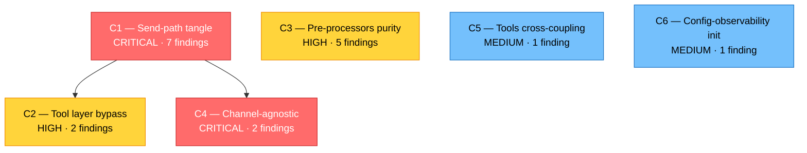
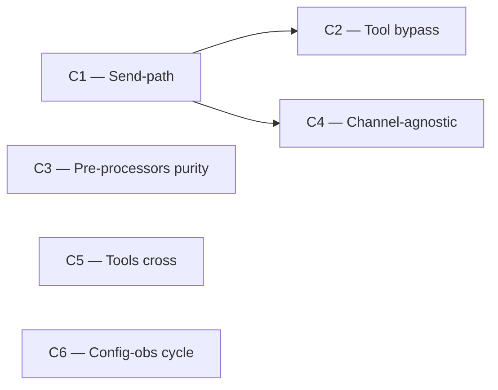
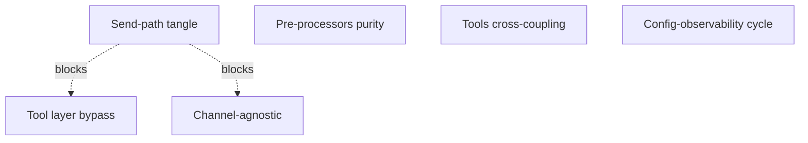

# Mermaid Preview — пример диаграммы зависимостей кластеров

Это preview-файл, не артефакт скилла. Открой в Markdown viewer'е (GitHub, IDE с Mermaid-расширением, Obsidian, Markdown Preview Enhanced в VS Code и т.д.) — диаграмма ниже должна отрендериться как графическое изображение. Если видишь только текст в code block'е — viewer не поддерживает Mermaid.

---

## Образец: campaign roadmap фрагмент с диаграммой зависимостей

**Сценарий-плейсхолдер:** проект-условный, в аудите выявлено 6 кластеров архитектурного долга, между ними есть зависимости.

### Кластеры в кампании

| ID | Название | Корневая причина | Размер | Приоритет |
|----|----------|------------------|--------|-----------|
| C1 | Send-path tangle | Нет выделенного transport-слоя | 7 findings | CRITICAL |
| C2 | Tool layer bypass | Бизнес-логика goal обходит dispatcher | 2 findings | HIGH |
| C3 | Pre-processors purity | Pre-processors зовут pipeline обратно | 5 findings | HIGH |
| C4 | Channel-agnostic violation | Validator/notifications импортируют channels | 2 findings | CRITICAL |
| C5 | Tools cross-coupling | Tools импортируют друг друга напрямую | 1 finding | MEDIUM |
| C6 | Config-observability init cycle | Циклическая инициализация | 1 finding | MEDIUM |

### Таблица зависимостей

| Что от чего зависит | Тип зависимости | Объяснение |
|---------------------|------------------|------------|
| C2 → C1 | Технический блокер | Tool routing зависит от transport-слоя, который выделяется в C1 |
| C4 → C1 | Технический блокер | Channel-agnostic restoration в notifications проще после extract transport/ |
| C3 ↔ ничего | Independent | Может идти параллельно остальным |
| C5 ↔ ничего | Independent | Изолированный, не блокирует другие |
| C6 ↔ ничего | Independent | Изолированный, не блокирует другие |

### Диаграмма зависимостей (Mermaid)

### Рекомендуемый порядок проработки

1. **C1** — первым (CRITICAL, разблокирует C2 и C4 через extract transport/).
2. **C4** — после C1 (вторая половина channel-agnostic — notifications уже сидит на transport-слое).
3. **C3** — параллельно с C1 / C4 (independent, HIGH severity, 5 findings — стоит momentum).
4. **C2** — после C1 (требует устаканенного transport-слоя).
5. **C5**, **C6** — в конце, по очереди (independent, MEDIUM, мелкие).

---

## Что в этом примере проверять

- **Текст диаграммы рендерится как графика?** Если да — Mermaid в твоём окружении работает.
- **Цветовая дифференциация по severity** (через `classDef`) — видна?
- **Подписи на двух строках** (через ` `) — отрисовываются корректно?
- **Стрелки направлены логично** (от блокирующего к блокируемому)?
- **При увеличении количества узлов до 10-15** диаграмма всё ещё читается? (этот тест на боевых данных будет, не сейчас).

---

## Несколько вариантов layout'а

Mermaid поддерживает разные направления — можно подобрать по вкусу:

### `flowchart LR` (left-to-right) — компактнее по вертикали

### `graph TB` (top-bottom, более formal стиль)

---

**Этот файл можно удалить после просмотра** — это sandbox для проверки рендера, не часть проекта.
