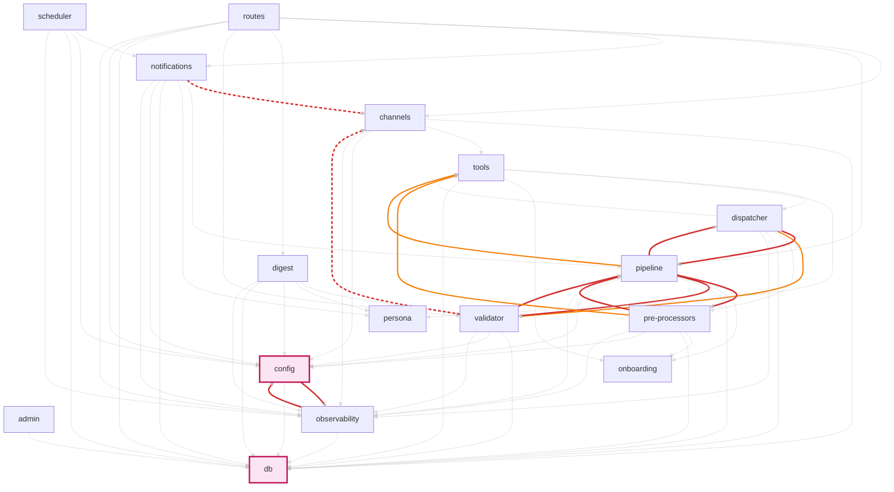
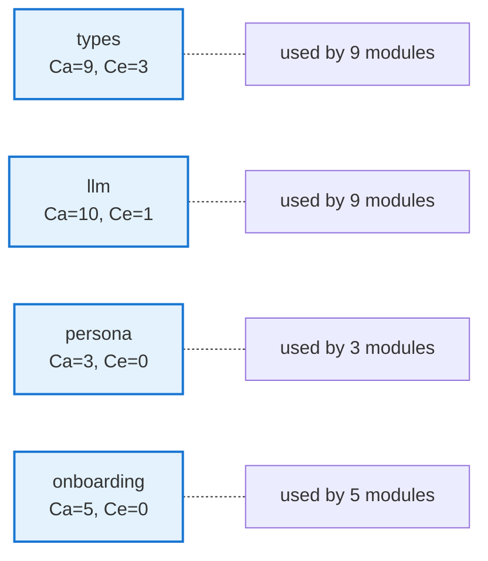
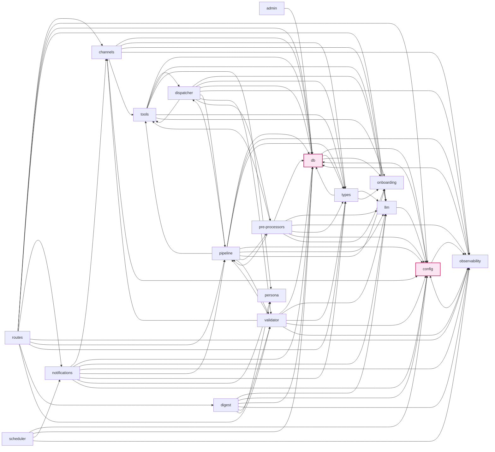
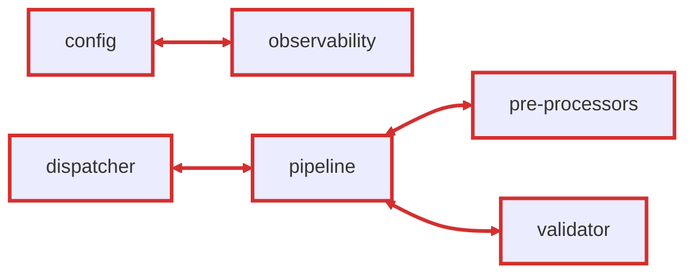
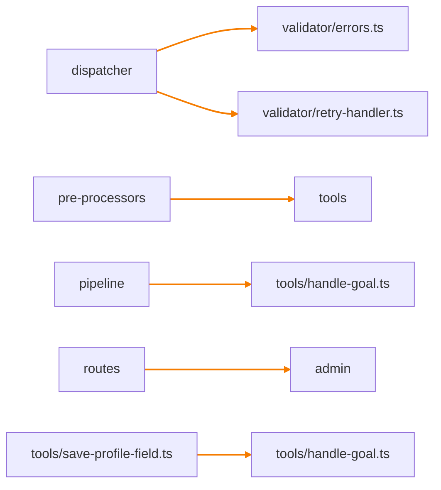

# Audit Report — zhenka-bot

**Mock example.** Демонстрирует формат output `hi_flow:arch-audit` (full mode) на реальных данных проекта Zhenka. Сгенерирован для предметного обсуждения формата визуализаций.

---

**Date:** 2026-04-28
**Audit SHA:** `9c66ab8` (current HEAD)
**Stack:** typescript-depcruise (v16.3.0)
**Project:** zhenka-bot (`src/`, 18 modules)

---

## Scope

arch-audit покрывает архитектурные нарушения (граф зависимостей, метрики связности, boundaries, structural patterns). Для **гигиены кода** (build correctness, dependency declarations, deprecated packages) запусти параллельно стандартный `npx depcruise --validate` (полный default ruleset) и `npm audit`. Для **code-level качества** (style, common bugs) — eslint с typescript-eslint config. Эти проверки **дополняют** arch-audit, не подменяются им.

---

## Severity roll-up

| Severity | Count | Rules triggered |
|---|---:|---|
| **CRITICAL** | 2 | `domain-no-channel-sdk` (project override of MEDIUM → CRITICAL) |
| **HIGH** | 8 | `inappropriate-intimacy` (4), `nccd-breach` (1), `dependency-hub` (2), boundary HIGH (custom rule from project) |
| **MEDIUM** | 6 | boundary MEDIUM (custom rules from project) |
| **error** | 0 | — |
| **warn** | 0 | — |
| **LOW** | 12 | `cross-module-import-info` (after suppression: only impacts non-overlap edges) |

**Total findings:** 28 (16 baseline + 12 informational).
**Total modules:** 18.
**Project NCCD:** 2.34 (default threshold 1.0, project override 2.0 → finding fires).

---

## Project Dependency Graph (focused view)

Высокоуровневая diagram **business-связи модулей**. Pure utility modules (types, llm) скрыты в Foundation diagram ниже — они используются почти всеми и создают visual noise без insight. Cycles и boundary violations — bold red, normal edges — subtle gray. Hub-like модули — розовые.

**Чтение легенды:**
- **Розовая заливка** (db, config) — hub-like-dependency findings (Ca > 10).
- **Толстые красные сплошные edges** — циклы (`inappropriate-intimacy`, `nccd-breach` contributors).
- **Толстые красные пунктирные edges** — CRITICAL channel-agnosticism violations.
- **Оранжевые edges** — MEDIUM boundary violations из project rules.
- **Тонкие серые edges** — normal dependencies (background context).

## Foundation modules

Stable utility modules — используются практически всеми. Скрыты из main view для читаемости. Все три не имеют findings.

**Layered architecture не detected** (имена директорий не из закрытого списка слоёв). Layered diagram пропущен. Если структура ваша — добавь alias map в project rules для активации layered-respect rule.

Full project graph (включая foundation edges) — нажми чтобы развернуть

---

## Module Metrics

| Module | Ca | Ce | I | Status |
|---|---:|---:|---:|---|
| **db** | 14 | 3 | 0.18 | hub-like (Ca > 10, no Ce) — **HIGH `dependency-hub`** |
| **config** | 11 | 2 | 0.15 | hub-like (Ca > 10) — **HIGH `dependency-hub`** |
| llm | 10 | 1 | 0.09 | borderline hub |
| observability | 10 | 2 | 0.17 | borderline hub |
| types | 9 | 3 | 0.25 | stable utility |
| onboarding | 5 | 0 | 0 | stable, abstract |
| pipeline | 5 | 10 | 0.67 | high-fanout candidate |
| validator | 4 | 7 | 0.64 | balanced |
| tools | 4 | 6 | 0.60 | balanced |
| channels | 3 | 6 | 0.67 | balanced |
| persona | 3 | 0 | 0 | stable, abstract |
| dispatcher | 2 | 8 | 0.80 | unstable |
| pre-processors | 2 | 8 | 0.80 | unstable |
| notifications | 2 | 8 | 0.80 | unstable |
| digest | 1 | 6 | 0.86 | unstable |
| admin | 0 | 1 | 1.0 | entry-point |
| routes | 0 | 10 | 1.0 | entry-point (high-fanout) |
| scheduler | 0 | 4 | 1.0 | entry-point |

**Метрики D (distance from main sequence) и A (abstractness) не computed** — для TypeScript adapter A детектируется через interface ratio, в текущей версии не реализовано. Diagnostic-only.

---

## Findings (по severity)

### CRITICAL — channel-agnosticism violations (2)

Project rule `domain-no-channel-sdk` override от MEDIUM до CRITICAL — channel-agnosticism foundational для бота.

**1. `validator/inbound.ts → channels/types.ts`** (type-only)
- **Principle:** channel-agnosticism
- **Reason:** validator — channel-agnostic middleware, не должен знать о channels.
- **Fix alternatives** (из D9):
  1. Extract transport layer — channel-agnostic типы (Message, Reply) в transport, channels как реализация.
  2. Adapter per channel — common interface, channels imports вынесены в adapters.
  3. DI of channel context — chat_id/user_id как opaque parameter.

**2. `notifications/internal.ts → channels/telegram/outbound-direct.ts`**
- **Principle:** channel-agnosticism
- **Reason:** notifications должны быть channel-agnostic.
- **Fix alternatives:** см. выше.

### HIGH — cycles + structural problems

#### Pairwise cycles (4) — все попадают под `inappropriate-intimacy`

| # | Cycle | Principle | Severity |
|---|---|---|---|
| 1 | `config ↔ observability` | acyclic-dependencies | HIGH |
| 2 | `dispatcher ↔ pipeline` | acyclic-dependencies | HIGH |
| 3 | `pipeline ↔ pre-processors` | acyclic-dependencies | HIGH |
| 4 | `pipeline ↔ validator` | acyclic-dependencies | HIGH |

#### Transitive cycles (2) — captured by `no-circular`

- `dispatcher → validator → pipeline → dispatcher` (length 3)
- `dispatcher → pre-processors → pipeline → dispatcher` (length 3)

Эти циклы проходят через **dispatcher → pipeline** edge. Suggested cluster: «extract transport layer» — fixes pairwise cycle 2 + both transitive cycles одновременно.

#### `dependency-hub` (2)

| Module | Ca | Ce | Threshold | Severity |
|---|---:|---:|---|---|
| **db** | 14 | 3 | Ca > max(20% × 18, 10) = 10 | HIGH |
| **config** | 11 | 2 | Ca > 10 | HIGH |

Оба — typical hub-like модули (high Ca alone, low Ce). Не god-objects (god требует AND Ce > 10, Ce у обоих ≤ 3). Hub-like = концентратор blast radius при изменениях.

**Fix alternatives (из D9 → hub-like-dependency):**
1. Stabilize the hub — повысить абстрактность (interfaces вместо concrete types).
2. Split hub by client groups — `db/profile/`, `db/conversation/`, etc. как отдельные sub-modules.
3. Introduce intermediate layer — обернуть в более абстрактный API.

#### `nccd-breach` (1)

NCCD = 2.34 при threshold 2.0 (project override от default 1.0).
Принцип: acyclic-dependencies (aggregate).
Сигнал общей запутанности проекта. Cycles + hubs суммарно создают tangled dep-graph.

### MEDIUM — boundary violations (project rules)

| # | Rule | From → To | Severity |
|---|---|---|---|
| 1 | `dispatcher→validator` | dispatcher/dispatcher.ts → validator/errors.ts | HIGH |
| 2 | `dispatcher→validator` | dispatcher/dispatcher.ts → validator/retry-handler.ts | HIGH |
| 3 | `pre-processors→pipeline` | pre-processors/passive-extractor.ts → pipeline/hook-registry.ts | HIGH |
| 4 | `db→onboarding` | db/profile.ts → onboarding/tdee.ts (type-only) | MEDIUM |
| 5 | `pre-processors→tools` (3 instances) | pre-processors/analyze-photo.ts → tools/shared/* | MEDIUM |
| 6 | `*→admin` | index.ts → admin/reset-user.ts | MEDIUM |
| 7 | `TOOLS-cross` | tools/save-profile-field.ts → tools/handle-goal.ts | MEDIUM |

Эти правила — project-specific (custom rules в zhenka project rules-файле, не baseline). Каждое ссылается на:
- (1, 2) middleware-boundary principle (P2 в Zhenka).
- (3, 5) single-responsibility-module / layered-architecture-respect.
- (6) module-boundary-awareness (admin temporary alpha).
- (7) **vertical-slice-cohesion** (tools/X не должен импортировать tools/Y минуя tools/shared/) — это **baseline** rule `vertical-slice-respect`.

### LOW — informational (12)

`cross-module-import-info` — после suppression precedence показано только 12 cross-module imports, на которые НЕ сработали более специфичные правила выше. Список в JSON; в markdown пропущено для читаемости.

---

## Cluster suggestions для arch-redesign

Auto-grouping по reason'ам — first draft cluster list (operator confirms / overrides в triage-mode):

### Cluster A — Channel coupling (channel-agnosticism)
- 2 CRITICAL findings (validator→channels, notifications→channels).
- **Single root cause:** отсутствие transport-слоя.
- **Recommended fix from D9:** extract transport layer.
- **Size:** 2 findings, small cluster.

### Cluster B — Dispatcher↔pipeline cycle
- 1 pairwise cycle + 2 transitive cycles + 2 dispatcher→validator HIGH.
- **Single root cause:** missing transport/outbound abstraction; dispatcher и pipeline владеют общей send-path логикой без extracted middleware.
- **Recommended fix:** extract transport/ или channels/outbound/ (DIP).
- **Size:** 5 findings, mid cluster.

### Cluster C — Hub-like infrastructure (db, config)
- 2 dependency-hub HIGH (db Ca=14, config Ca=11).
- **Single root cause:** monolithic data + config layers.
- **Recommended fix:** split by client groups (db/profile, db/conversation; config/runtime, config/api-keys).
- **Size:** 2 findings, small cluster.

### Cluster D — Pre-processors purity (pre-processors→pipeline + pre-processors→tools)
- 1 HIGH + 3 MEDIUM.
- **Single root cause:** pre-processors trespass beyond pure transformation role.
- **Recommended fix:** move logic to pipeline (reverse coupling) или tools (forward call).
- **Size:** 4 findings, mid cluster.

### Cluster E — Tools cross-coupling (vertical-slice-cohesion)
- 1 MEDIUM (tools/save-profile-field → tools/handle-goal).
- **Single root cause:** vertical slice violation.
- **Recommended fix:** move shared logic to tools/shared/ или inline.
- **Size:** 1 finding, isolated.

### Cluster F — Admin temporary boundary (project-specific)
- 1 MEDIUM (index → admin).
- **Project rule:** admin alpha-only, no external imports.
- **Recommended fix:** remove admin entry or restrict route access.
- **Size:** 1 finding, isolated.

### Cluster G — config↔observability cycle (NCCD contributor)
- 1 pairwise cycle (config ↔ observability).
- **Single root cause:** observability depends on config (settings), config depends on observability (telemetry init order).
- **Recommended fix:** lazy-load observability OR extract telemetry config to types.
- **Size:** 1 finding, isolated.

**NCCD breach** — следствие clusters A-G. Лечится автоматически после расшивки топ-3 (A + B + C).

---

## Dependency Graph (machine-readable)

Полная adjacency list — в `audit-report.json` → `metrics.dep_graph`. Используется arch-redesign и arch-spec для downstream обработки.

---

## Notes for operator

- **Suppression precedence applied:** некоторые cross-module imports показаны только в Cluster B/D (более специфичные rules), не дублированы в LOW informational.
- **Custom rules from project rules-файл** (`docs/project/dependency_rules.yaml`) учтены поверх baseline. Список — см. project rules.
- **NCCD threshold override** до 2.0 (default 1.0) — задокументировано в project rules как «accepted complexity для legacy phase».

Для перехода к refactor planning — запусти `arch-redesign` (он подхватит этот audit-report как input).
