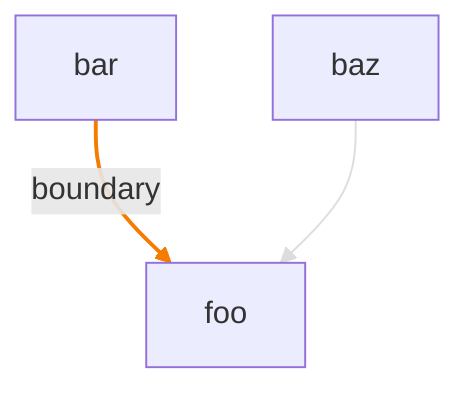
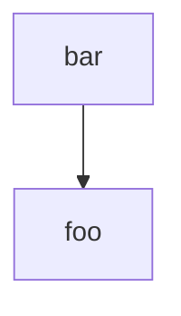

# Audit Report

**Date:** 2026-04-29T02:23:01.751Z
**Audit SHA:** `uuid:barrel-test`
**Stack:** typescript-depcruise (16.3.0)
**Total modules:** 3

## Severity roll-up

| Severity | Count |
|---|---:|
| CRITICAL | 0 |
| HIGH | 0 |
| MEDIUM | 1 |
| LOW | 0 |

**NCCD:** 1.67 (threshold 1)

## Project Dependency Graph

## Layered architecture

Layered structure не detected — closed list имён слоёв (domain / core / business / services / api / web / ui / infrastructure / ...) не совпал с module naming проекта. Conditional rules `baseline:layered-respect`, `baseline:port-adapter-direction`, `baseline:architectural-layer-cycle` не применялись.

## Module Metrics

| Module | Ca | Ce | I | LOC |
|---|---:|---:|---:|---:|
| `bar` | 0 | 1 | 1.00 | 0 |
| `baz` | 0 | 1 | 1.00 | 0 |
| `foo` | 2 | 0 | 0.00 | 0 |

## Findings (1)

### f-001 — baseline:barrel-file (MEDIUM)
**Source → Target:** `bar` → `foo`
**Reason:** barrel-discipline — Module {module} has a barrel index file (src/foo/index.ts) imported by sibling modules (bar). Barrels obscure the real dependency graph; prefer explicit deep imports.

## Cluster suggestions

### barrel-discipline (1 findings)
**Root cause:** _(cluster prose not generated — clusterProsefn not provided to buildReport)_

