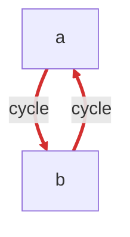
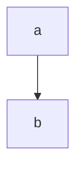

# Audit Report

**Date:** 2026-04-29T02:26:25.819Z
**Audit SHA:** `uuid:cycle-test`
**Stack:** typescript-depcruise (16.3.0)
**Total modules:** 2

## Severity roll-up

| Severity | Count |
|---|---:|
| CRITICAL | 0 |
| HIGH | 2 |
| MEDIUM | 0 |
| LOW | 0 |

**NCCD:** 2.00 (threshold 1)

## Project Dependency Graph

## Layered architecture

Layered structure не detected — closed list имён слоёв (domain / core / business / services / api / web / ui / infrastructure / ...) не совпал с module naming проекта. Conditional rules `baseline:layered-respect`, `baseline:port-adapter-direction`, `baseline:architectural-layer-cycle` не применялись.

## Module Metrics

| Module | Ca | Ce | I | LOC |
|---|---:|---:|---:|---:|
| `a` | 1 | 1 | 0.50 | 0 |
| `b` | 1 | 1 | 0.50 | 0 |

## Findings (2)

### f-001 — baseline:no-circular (HIGH)
**Source → Target:** `a` → `b`
**Reason:** acyclic-dependencies — Circular dependency detected between modules.

### f-002 — baseline:inappropriate-intimacy (HIGH)
**Source → Target:** `a` → `b`
**Reason:** acyclic-dependencies — Two-module cycle — modules know each other intimately.

## Cluster suggestions

### acyclic-dependencies (2 findings)
**Root cause:** _(cluster prose not generated — clusterProsefn not provided to buildReport)_

