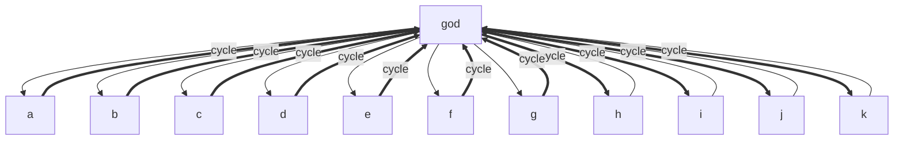
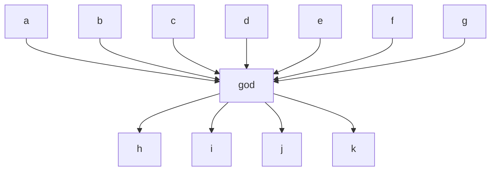

# Audit Report

**Date:** 2026-04-28T12:00:15.603Z
**Audit SHA:** `uuid:god-test`
**Stack:** typescript-depcruise (16.3.0)
**Total modules:** 12

## Severity roll-up

| Severity | Count |
|---|---:|
| CRITICAL | 0 |
| HIGH | 13 |
| MEDIUM | 0 |
| LOW | 0 |

**NCCD:** 12.00 (threshold 1)

## Project Dependency Graph

## Findings (13)

### f-001 — baseline:god-object (HIGH)
**Source → Target:** `god` → `god`
**Reason:** god-object-prohibition — Module has high incoming AND outgoing coupling AND large LOC — multiple responsibilities.

### f-002 — baseline:dependency-hub (HIGH)
**Source → Target:** `god` → `god`
**Reason:** hub-like-dependency — Module is a dependency hub: Ca exceeds max(20% of total modules, 10).

### f-003 — baseline:inappropriate-intimacy (HIGH)
**Source → Target:** `god` → `h`
**Reason:** acyclic-dependencies — Two-module cycle — modules know each other intimately.

### f-004 — baseline:inappropriate-intimacy (HIGH)
**Source → Target:** `god` → `i`
**Reason:** acyclic-dependencies — Two-module cycle — modules know each other intimately.

### f-005 — baseline:inappropriate-intimacy (HIGH)
**Source → Target:** `god` → `j`
**Reason:** acyclic-dependencies — Two-module cycle — modules know each other intimately.

### f-006 — baseline:inappropriate-intimacy (HIGH)
**Source → Target:** `god` → `k`
**Reason:** acyclic-dependencies — Two-module cycle — modules know each other intimately.

### f-007 — baseline:inappropriate-intimacy (HIGH)
**Source → Target:** `a` → `god`
**Reason:** acyclic-dependencies — Two-module cycle — modules know each other intimately.

### f-008 — baseline:inappropriate-intimacy (HIGH)
**Source → Target:** `b` → `god`
**Reason:** acyclic-dependencies — Two-module cycle — modules know each other intimately.

### f-009 — baseline:inappropriate-intimacy (HIGH)
**Source → Target:** `c` → `god`
**Reason:** acyclic-dependencies — Two-module cycle — modules know each other intimately.

### f-010 — baseline:inappropriate-intimacy (HIGH)
**Source → Target:** `d` → `god`
**Reason:** acyclic-dependencies — Two-module cycle — modules know each other intimately.

### f-011 — baseline:inappropriate-intimacy (HIGH)
**Source → Target:** `e` → `god`
**Reason:** acyclic-dependencies — Two-module cycle — modules know each other intimately.

### f-012 — baseline:inappropriate-intimacy (HIGH)
**Source → Target:** `f` → `god`
**Reason:** acyclic-dependencies — Two-module cycle — modules know each other intimately.

### f-013 — baseline:inappropriate-intimacy (HIGH)
**Source → Target:** `g` → `god`
**Reason:** acyclic-dependencies — Two-module cycle — modules know each other intimately.

## Cluster suggestions

### god-object-prohibition (1 findings)
**Root cause:** _(cluster prose not generated — clusterProsefn not provided to buildReport)_

### hub-like-dependency (1 findings)
**Root cause:** _(cluster prose not generated — clusterProsefn not provided to buildReport)_

### acyclic-dependencies (11 findings)
**Root cause:** _(cluster prose not generated — clusterProsefn not provided to buildReport)_

