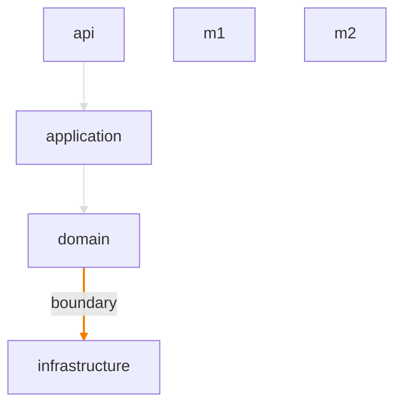
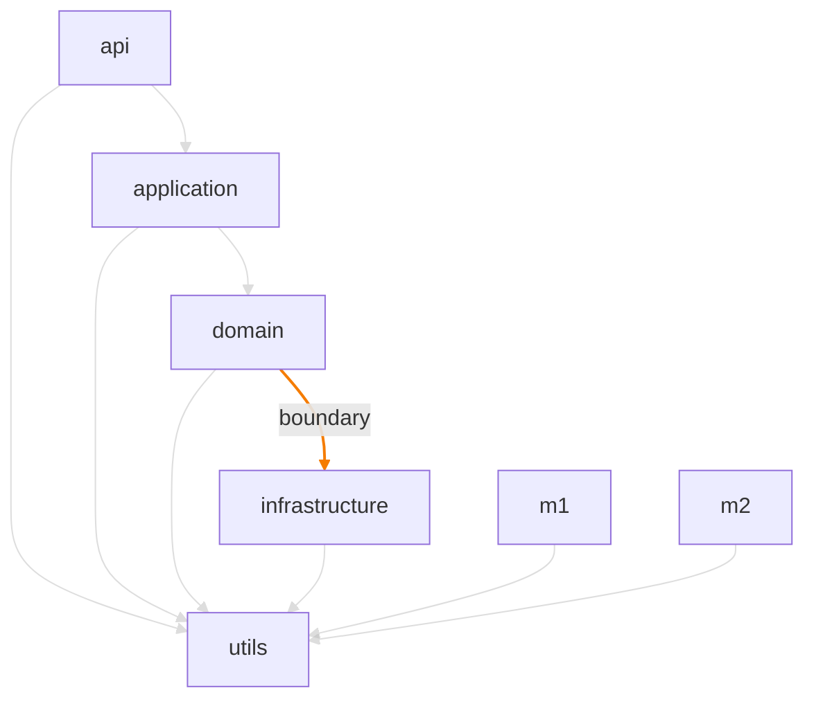
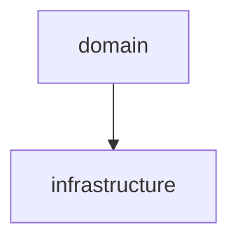

# Audit Report

**Date:** 2026-04-28T20:42:27.312Z
**Audit SHA:** `uuid:layered-test`
**Stack:** typescript-depcruise (16.3.0)
**Total modules:** 7

## Severity roll-up

| Severity | Count |
|---|---:|
| CRITICAL | 0 |
| HIGH | 0 |
| MEDIUM | 1 |
| LOW | 0 |

**NCCD:** 2.71 (threshold 1)

## Project Dependency Graph

Focused view: 1 pure-utility module(s) hidden in Foundation diagram below.

## Foundation modules

Pure utility modules (Ca > 5, Ce ≤ 3, no findings) hidden from focused view: `utils`.

## Layered architecture view

Detected layered structure — diagram below shows inter-layer flows; direction violations are highlighted.

## Module Metrics

| Module | Ca | Ce | I | LOC |
|---|---:|---:|---:|---:|
| `api` | 0 | 2 | 1.00 | 0 |
| `application` | 1 | 2 | 0.67 | 0 |
| `domain` | 1 | 2 | 0.67 | 0 |
| `infrastructure` | 1 | 1 | 0.50 | 0 |
| `m1` | 0 | 1 | 1.00 | 0 |
| `m2` | 0 | 1 | 1.00 | 0 |
| `utils` | 6 | 0 | 0.00 | 0 |

## Findings (1)

### f-001 — baseline:port-adapter-direction (MEDIUM)
**Source → Target:** `domain` → `infrastructure`
**Reason:** port-adapter-separation — Domain imports infrastructure directly — should go through ports/adapters.

## Cluster suggestions

### port-adapter-separation (1 findings)
**Root cause:** _(cluster prose not generated — clusterProsefn not provided to buildReport)_

