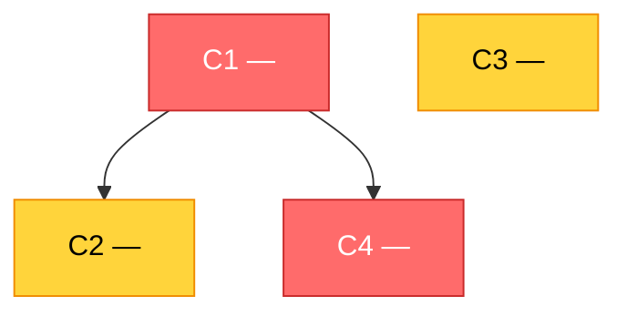

# Campaign Roadmap

> Шаблон output triage-сессии скилла `hi_flow:arch-redesign`. Заменяй `<placeholder>` конкретным содержимым. Артефакт читается оператором как навигация по серии cluster-mode сессий.

**Date:** YYYY-MM-DD
**Source audit:** <путь к audit-report директории>
**Audit SHA:** `<audit_sha>` (на момент аудита)

---

## Статистика audit'а

- Всего findings: <N>
- Severity breakdown: CRITICAL=<X>, HIGH=<Y>, MEDIUM=<Z>, LOW=<W>
- Unmapped findings: <K>
- Auto-grouped clusters: <M>

---

## Кампанийные кластеры

### C1 — `<Cluster Name>`

**Корневая причина:** `<принцип из библиотеки>` — <краткая формулировка>.

**Входящие findings** (N):

- `<finding_id_1>` — <тип>, <severity> — `<source>` → `<target>`.
- `<finding_id_2>` — <...>
- <...>

**Размер:** `<small / medium / large>` (рекомендуемый диапазон 3-7 нарушений; 10+ требует обоснования).

**Приоритет:** `<CRITICAL / HIGH / MEDIUM / LOW>`.

### C2 — `<Cluster Name>`

<...>

### Cn — `<Cluster Name>`

<...>

---

## Принятые архитектурные долги

(уходят в Known Drift через скилл `architecture` или его эквивалент; не идут в impl)

### D1 — `<Cluster Name>`

**Причина принятия:** <почему сознательно не лечим в этой кампании>.

**Входящие findings:**

- `<finding_id>` — <...>
- <...>

---

## Отложенные кластеры

(перенос на следующую кампанию; не идут в impl сейчас)

### Def1 — `<Cluster Name>`

**Причина откладывания:** <почему не сейчас>.

**Входящие findings:**

- `<finding_id>` — <...>
- <...>

---

## Зависимости между кампанийными кластерами

| Кластер | Зависит от | Тип зависимости | Объяснение |
|---------|-----------|-----------------|------------|
| `<C2>` | `<C1>` | Технический блокер | <...> |
| `<C4>` | `<C1>` | Общие модули | <...> |
| `<C3>` | — | Independent | Может идти параллельно остальным |
| <...> | <...> | <...> | <...> |

---

## Диаграмма зависимостей (Mermaid)

> **Source of truth — таблица выше.** Эта диаграмма перегенерируется по таблице после любого её изменения. Если редактируешь таблицу, обнови и блок ниже.

---

## Рекомендуемый порядок проработки

1. **C1** — первым (CRITICAL, разблокирует C2 и C4).
2. **C4** — после C1 (<...>).
3. **C3** — параллельно с C1/C4 (independent, HIGH severity, momentum).
4. **C2** — после C1.
5. <...>

---

## Expected post-campaign state

После исполнения всех кампанийных кластеров (включая impl):

**Архитектурные принципы, нарушения которых должны исчезнуть из audit'а:**

- `<принцип 1 из библиотеки>` — за счёт C1 + C4.
- `<принцип 2>` — за счёт C3.
- <...>

**Конкретные нарушения, которые должны исчезнуть** (deterministic, по списку findings в кампанийных кластерах):

- `<finding_id>` (cluster `<C1>`)
- <...>

**Качественные направления изменения числовых метрик:**

- NCCD должен `<упасть / остаться стабильным>` (ожидание: closing cycles снижает CCD).
- Per-module Ca/Ce/I модулей `<X, Y, Z>` должны `<нормализоваться / измениться так-то>`.

После завершения кампании оператор re-run'ит `arch-audit` и сравнивает с этой базой:

- Совпадение → campaign success, методология работает.
- Расхождение → анализ: были ли прогнозы кривые, была ли импл неполной, появились ли новые архитектурные сигналы.

---

## Notes

- <Опционально: дополнительные замечания, контекст из обсуждения с оператором, ссылки на референсы.>
