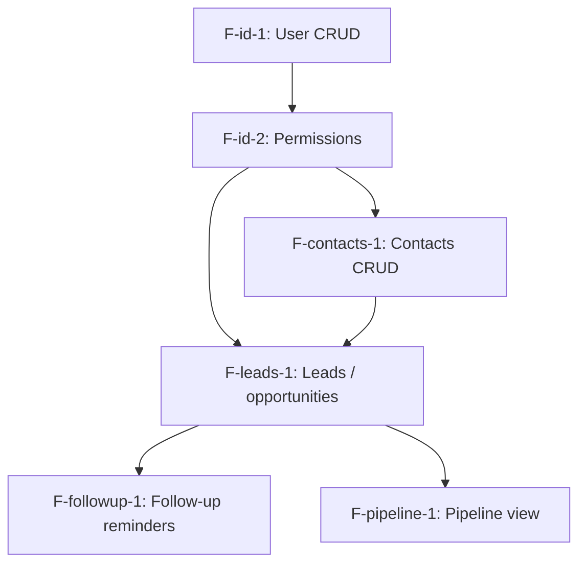

# Worked Example: Contact Tracker MVP

> **Reference example for `hi_flow:product-spec` skill.** Это сводный пример: полная `product-spec.md` для одной итерации (MVP) небольшого commercial-leaning продукта **плюс** сопроводительная `product-backlog.md`, которая получится после closure migration этой итерации. Используй как якорь формата и tone при генерации реальных product-spec.md и product-backlog.md.
>
> **Что демонстрирует пример:**
> - Все 12 секций product-spec.md (per D12), включая mandatory Mermaid в Section 4.
> - Корректное D6 card format: Type / Status / Назначение / Входит / Не входит / Зависит от + опционально Доступно группам.
> - Asymmetric pointer discipline в backlog (per D17): 5-6 строк для shipped enabler, 3 строки для shipped domain, full content для parked / deferred, one-liner для rejected.
> - Один resolved strategic fork (Sf1) → остаётся только в spec'е.
> - Один deferred strategic fork (Sf2) → переезжает в backlog § Deferred forks.
> - Одна standing CC policy (CC1: audit log) → впервые введена в этой итерации, добавляется pointer'ом в backlog § Standing CC policies.
> - Status: `signed` — дизайн закрыт после User Review Gate, готов идти в feature-spec (per D18).
> - Plain Russian product language — engineer-only жаргон не используется.

---

## Part 1: product-spec.md (after closure of iter1)

````markdown
# Contact Tracker — iter1: mvp

**Дата:** 2026-05-15
**Статус:** signed
**Версия итерации:** mvp (v1.0)
**Автор:** [operator name]
**Iteration slug:** mvp

## 1. Описание продукта

- **Что:** инструмент учёта контактов и заявок для small business sales-команды (2-3 человека).
- **Тип проекта:** коммерческая разработка под конкретного заказчика (small accounting firm).
- **Заказчик ↔ пользователь:** заказчик — владелец фирмы; пользователи — sales rep, manager, иногда сам владелец.
- **Бизнес-цели заказчика:**
  - сокращение упущенных заявок (currently 30% lost из-за забытых follow-up'ов);
  - видимость текущего pipeline'а для manager / owner.

## 2. Группы пользователей

- **Sales rep** — добавляет контакты, ведёт переписку, выставляет follow-up'ы, закрывает сделки. Основная цель: не упускать заявки и не держать состояние в голове.
- **Manager** — видит pipeline и активность всех rep'ов, может re-assign контакты. Основная цель: видимость нагрузки команды и оперативное вмешательство при перекосах.
- **Owner** (occasional user) — видит manager-level + executive summary. Основная цель: понимать, что происходит в продажах, не вникая в каждую сделку.

## 3. Задачи пользователей

| Группа     | Задачи                                                                                                                    |
|------------|---------------------------------------------------------------------------------------------------------------------------|
| Sales rep  | добавить контакт; добавить заявку; поставить follow-up; пометить «закрыто/успех», «закрыто/отказ»; видеть свои follow-up'ы |
| Manager    | видеть pipeline всех rep'ов; re-assign контакт; смотреть отчёт по упущенным follow-up'ам                                  |
| Owner      | видеть pipeline + executive summary (counts + revenue projection)                                                         |

**Buyer outcomes mapping:**

- «сокращение упущенных заявок» → задачи rep'а «поставить follow-up», «видеть активные follow-up'ы» + manager «отчёт по упущенным».
- «видимость pipeline'а» → manager + owner pipeline-задачи.

## 4. Модули и функции



### Модуль: Identity

#### F-id-1. User CRUD

**Тип:** поддерживающая
**Статус:** in-scope
**Назначение:** учёт пользователей системы (3 роли: rep, manager, owner) — добавление, удаление, смена роли.
**Входит:** create / read / update / delete пользователей; назначение и смена роли.
**Не входит (это отдельная функция):** самостоятельная регистрация пользователей (заказчик заводит руками); восстановление пароля через email (пока админ-сброс).
**Зависит от:** —

#### F-id-2. Permissions

**Тип:** поддерживающая
**Статус:** in-scope
**Назначение:** простая ролевая модель: rep видит свои контакты, manager — все контакты своих rep'ов, owner — всё.
**Входит:** проверка прав на чтение и изменение контактов и заявок per role.
**Не входит (это отдельная функция):** иерархические роли с inheritance (избыточно для команды из 2-3 человек); ABAC; права per-field.
**Зависит от:** F-id-1

### Модуль: Contacts

#### F-contacts-1. Contacts CRUD

**Тип:** пользовательская
**Статус:** in-scope
**Назначение:** контакт = карточка лица (имя, компания, телефон, email, заметки) с историей взаимодействий.
**Входит:** CRUD контактов; поиск по имени / компании; история взаимодействий (текст + дата) внутри карточки.
**Не входит (это отдельная функция):** автоматический импорт из email-ящика; интеграция с LinkedIn; bulk import из CSV.
**Зависит от:** F-id-2
**Доступно группам:** sales rep (свои), manager (свои rep'ов), owner (все)

### Модуль: Leads

#### F-leads-1. Leads / opportunities

**Тип:** пользовательская
**Статус:** in-scope
**Назначение:** заявка = возможность сделки, привязана к контакту, имеет сумму, статус (new / negotiating / closed-won / closed-lost), assigned rep.
**Входит:** CRUD заявок; привязка к контакту; смена статусов; re-assign (manager-only).
**Не входит (это отдельная функция):** генерация коммерческого предложения / контракта; интеграция с бухгалтерией; sub-tasks внутри заявки.
**Зависит от:** F-contacts-1, F-id-2
**Доступно группам:** sales rep (свои), manager (свои rep'ов + re-assign), owner (все)

#### F-followup-1. Follow-up reminders

**Тип:** пользовательская
**Статус:** in-scope
**Назначение:** rep ставит дату follow-up'а на заявку; в назначенный день — email-напоминание.
**Входит:** установка / изменение / удаление даты follow-up'а на заявке; email-напоминание в назначенный день.
**Не входит (это отдельная функция):** sms / push / Telegram-напоминания; интеграция с календарём; повторяющиеся напоминания.
**Зависит от:** F-leads-1
**Доступно группам:** sales rep, manager (overview)

### Модуль: Reports

#### F-pipeline-1. Pipeline view

**Тип:** пользовательская
**Статус:** in-scope
**Назначение:** табличный обзор всех заявок с фильтрами (rep, status, value range) для manager / owner.
**Входит:** табличный обзор, фильтры, сортировка, summary counts (active leads, won this month, lost this month, projected revenue).
**Не входит (это отдельная функция):** продвинутая аналитика (cohort, conversion funnels); экспорт в PDF; графические dashboards.
**Зависит от:** F-leads-1
**Доступно группам:** manager, owner (rep видит свои заявки через F-leads-1, отдельный pipeline-view ему не нужен)

## 5. Стратегические развилки

### Sf1. Канал follow-up reminders в MVP [decision: какой канал напоминаний использовать в MVP] [status: RESOLVED]

**Resolution:** только email в MVP.

**Reasoning:** команда уже постоянно в email — это был ключевой signal от заказчика. In-app требует периодического входа в систему (по их workflow ≤1 раз/день в среднем), что недостаточно для timely напоминаний. Расширение на дополнительные каналы — отдельная итерация по факту запроса.

**Branches [XOR]:**

- Sf1.1 — только email → impact: F-followup-1 в текущем виде. **RESOLVED.**
- Sf1.2 — только in-app → impact: F-followup-1 без email-канала, требуется отдельная подсистема in-app notifications. **ОТВЕРГНУТО.**
- Sf1.3 — оба канала → impact: F-followup-1 + новая F-notif-1 (in-app notifications). **DEFERRED для возможного v2.**

**Связи:** F-followup-1.

## 6. Сквозные политики

### CC1. Audit log для leads и follow-up status transitions

**Применяется к:** F-leads-1, F-followup-1
**Resolution:** все изменения статусов заявок и параметров follow-up'ов логируются в audit log с полями user / timestamp / before / after. Просмотр audit log доступен manager и owner.
**Pattern:** «При изменении status или follow-up — записать в audit log».

(Standing policy для будущих итераций — manager и owner ожидают audit для compliance. Помечается как cross-iteration policy → попадёт в backlog § Standing CC policies при closure.)

## 7. Переиспользуемые подполитики

(нет — продукт компактный, P-policies не выделялись)

## 8. Базовые требования к нагрузке и доступности

(не применимо — Шаг 11 не сработал; команда из 2-3 человек, нагрузка тривиальная, NFR — материал arch-spec)

## 9. Примерные сценарии работы

### Сценарий: rep ведёт сделку до закрытия

Rep получает входящий email о потенциальной сделке. Открывает Contact Tracker, добавляет контакт (F-contacts-1), создаёт заявку (F-leads-1) со статусом `new` и суммой. Ставит follow-up на завтра (F-followup-1). На следующий день получает email-напоминание, переписывается с клиентом, ставит status `negotiating`, новый follow-up через 3 дня. После переговоров — status `closed-won` с финальной суммой. Manager видит сделку в pipeline (F-pipeline-1) с её историей.

### Сценарий: manager перераспределяет нагрузку

Manager видит в pipeline (F-pipeline-1), что у одного rep'а 25 активных заявок, у другого — 5. Открывает заявки первого rep'а, делает re-assign 10 из них на второго (F-leads-1, manager-only operation). Audit log (CC1) фиксирует re-assign'ы с before / after.

## 10. Ссылки на парковку

Из этой спеки в backlog перенесены:

- **F-import-1** (bulk contact import из CSV) → parked (level: partial). Полезна, но в MVP не входит — пока вручную добавляют. См. backlog § Parked features.
- **F-quote-1** (генерация коммерческого предложения из заявки) → parked (level: note). Идея пришла во время дизайна, помогает закрывать сделки быстрее, но требует значительной template-работы — отложено. См. backlog § Parked features.
- **Sf2** (multi-tenant SaaS deployment vs single-tenant) → deferred. Этот клиент один, single-tenant. Если решим product-tize — пересмотрим. См. backlog § Deferred strategic forks.
- **F-mobile-1** (native mobile app) → rejected. Команда работает с десктопа в офисе, mobile не нужен. См. backlog § Out-of-scope.

Полные карточки и причины — в backlog. Эта секция — навигация.

## 11. Что может пойти не так

Premortem на 6 месяцев после запуска MVP:

- **«Rep не использует follow-up'ы»** — рассчитываем на behavior change, может не случиться. Mitigation: manager видит follow-up activity per rep в pipeline view (F-pipeline-1), может коучить. Триггер для re-evaluation: к 3 месяцу <50% заявок имеют follow-up — пересмотреть UX установки follow-up'а в новой итерации.
- **«Manager не открывает pipeline»** — если manager по факту менеджит через Excel-таблицы по привычке. Mitigation для следующих итераций: weekly auto-email с pipeline summary (триггер для новой фичи F-summary-mail-1, не входит в MVP).
- **«Нужен mobile»** — если команда вырастет и часть начнёт работать выездом. Триггер для re-evaluation F-mobile-1 из rejected → новая итерация.
- **«Не справляется с объёмом»** — если приходит 100+ заявок/день, фильтры pipeline'а станут неудобными. Триггер для F-search-1 + advanced filters в новой итерации.
- **«Заказчик хочет multi-tenant»** — если продукт начнёт продаваться третьим сторонам. Триггер для resolution Sf2 (multi-tenant deployment) — отдельная стратегическая итерация.

## 12. Открытые вопросы на момент закрытия сессии

| ID            | Тип                  | Описание                                                                                          | Likely blocker / nice-to-have / уточнить                          |
|---------------|----------------------|---------------------------------------------------------------------------------------------------|-------------------------------------------------------------------|
| F-followup-1  | scope cut уточнить   | какой час дня для email-напоминаний — фиксированные 9 утра или configurable per user?             | nice-to-have, default 9am, configurable можно добавить в feature-spec |
| F-pipeline-1  | scope cut уточнить   | какой default-фильтр у manager'а — все active заявки или только assigned to me as supervisor?     | уточнить с заказчиком до feature-spec                             |
````

---

## Part 2: product-backlog.md (after closure migration)

````markdown
# Contact Tracker — Backlog

**Дата создания:** 2026-05-15
**Дата последнего обновления:** 2026-05-15
**Версия структуры:** 1

## Iteration index

| Дата       | Slug | Статус | Spec                                                                  |
|------------|------|--------|-----------------------------------------------------------------------|
| 2026-05-15 | mvp  | signed | docs/specs/2026-05-15-contact-tracker-mvp-product-spec.md             |

## Shipped features

### Module: Identity

#### F-id-1. User CRUD [shipped iter1: mvp]
**Module:** Identity
**Type:** enabler
**Назначение:** учёт пользователей системы (3 роли: rep, manager, owner) — добавление, удаление, смена роли
**Входит:** create / read / update / delete пользователей; назначение и смена роли
**Не входит:** самостоятельная регистрация; восстановление пароля через email
**Spec:** docs/specs/2026-05-15-contact-tracker-mvp-product-spec.md § F-id-1

#### F-id-2. Permissions [shipped iter1: mvp]
**Module:** Identity
**Type:** enabler
**Назначение:** простая ролевая модель: rep видит свои контакты, manager — контакты своих rep'ов, owner — всё
**Входит:** проверка прав на чтение и изменение контактов и заявок per role
**Не входит:** иерархические роли с inheritance; ABAC; права per-field
**Spec:** docs/specs/2026-05-15-contact-tracker-mvp-product-spec.md § F-id-2

### Module: Contacts

#### F-contacts-1. Contacts CRUD [shipped iter1: mvp]
**Module:** Contacts
**Type:** domain
**Назначение:** карточка контакта (имя, компания, телефон, email, заметки) с историей взаимодействий
**Spec:** docs/specs/2026-05-15-contact-tracker-mvp-product-spec.md § F-contacts-1

### Module: Leads

#### F-leads-1. Leads / opportunities [shipped iter1: mvp]
**Module:** Leads
**Type:** domain
**Назначение:** заявка = возможность сделки, привязана к контакту, со статусом и assigned rep
**Spec:** docs/specs/2026-05-15-contact-tracker-mvp-product-spec.md § F-leads-1

#### F-followup-1. Follow-up reminders [shipped iter1: mvp]
**Module:** Leads
**Type:** domain
**Назначение:** установка даты follow-up'а на заявку с email-напоминанием в назначенный день
**Spec:** docs/specs/2026-05-15-contact-tracker-mvp-product-spec.md § F-followup-1

### Module: Reports

#### F-pipeline-1. Pipeline view [shipped iter1: mvp]
**Module:** Reports
**Type:** domain
**Назначение:** табличный обзор всех заявок с фильтрами для manager / owner
**Spec:** docs/specs/2026-05-15-contact-tracker-mvp-product-spec.md § F-pipeline-1

## Parked features

### F-import-1. Bulk contact import из CSV (level: partial)

**Status:** parked
**Originating analysis:** docs/specs/2026-05-15-contact-tracker-mvp-product-spec.md (Шаг 4 Domain feature enumeration)
**Reason for parking:** заказчик подтвердил, что в MVP вручную справляются (контактов <50 на старте); автоимпорт упрощает миграцию из существующей Excel-таблицы — нужен, но не блокирует запуск.
**Carry-over candidate for:** iter2+ (когда команда вырастет или появится клиент с большой существующей базой).

**Тип:** пользовательская
**Назначение:** загрузка списка контактов из CSV-файла одним действием.
**Входит:** upload CSV; маппинг колонок на поля карточки контакта; preview перед импортом; rollback в случае ошибки.
**Не входит (это отдельная функция):** импорт из Google Contacts / LinkedIn API; дедупликация контактов по полям (отдельная фича); incremental import (только новые).
**Зависит от:** F-contacts-1

### F-quote-1. Генерация коммерческого предложения из заявки (level: note)

**Status:** parked
**Originating analysis:** docs/specs/2026-05-15-contact-tracker-mvp-product-spec.md (Premortem Шаг 11 + buyer outcome «упрощение продажного цикла»)
**Reason for parking:** идея пришла во время дизайна, помогает закрывать сделки быстрее, но требует значительной template-работы (брендинг, реквизиты, варианты ценообразования) и интеграции с docs / PDF generation. Не вписывается в MVP-бюджет.
**Carry-over candidate for:** iter3+ (после стабилизации основного workflow).

Идея: из заявки одним действием сгенерировать commercial proposal в виде PDF с реквизитами компании и client'а, описанием услуг, ценой и сроками. Шаблоны редактируются manager / owner. Возможно в связке с e-signature.

## Deferred strategic forks

### Sf2. Multi-tenant SaaS deployment vs single-tenant

**Originating spec:** docs/specs/2026-05-15-contact-tracker-mvp-product-spec.md (Сквозная проверка Strategic forks classification, Шаг 12)
**Reason for deferring:** на данный момент один заказчик, single-tenant deployment даёт максимально простую модель. Multi-tenant — стратегическое решение про productization, требует отдельной итерации с продуктовым исследованием рынка.

**Branches [XOR]:**

- Sf2.1 — single-tenant per customer → impact: каждый заказчик получает отдельную инсталляцию. Простая модель данных, нет cross-tenant security concerns. **CURRENT (default по умолчанию).**
- Sf2.2 — multi-tenant SaaS → impact: появляется концепция организации (Tenant) над пользователями, изоляция данных per tenant, billing model, self-service регистрация. Существенно меняет состав фич: добавляется F-tenancy-1, F-billing-1, F-onboarding-1. **DEFERRED.**

**Триггер для resolution:** appearance второго заказчика, либо стратегическое решение заказчика про продажу инструмента третьим сторонам.

**Связи (потенциальные):** F-id-1 (расширение до tenant-aware users), F-id-2 (расширение прав до tenant-isolation), все domain features (расширение до tenant-scoped data).

## Out-of-scope (rejected)

- **F-mobile-1** (native mobile app) — отвергнуто iter1, причина: команда работает с десктопа в офисе, mobile не приносит ценности; альтернатива при необходимости — responsive web. Триггер для пересмотра: команда вырастет, появится выездная работа.

## Standing cross-cutting policies

- **CC1.** Audit log для leads и follow-up status transitions → docs/specs/2026-05-15-contact-tracker-mvp-product-spec.md § CC1.
````
