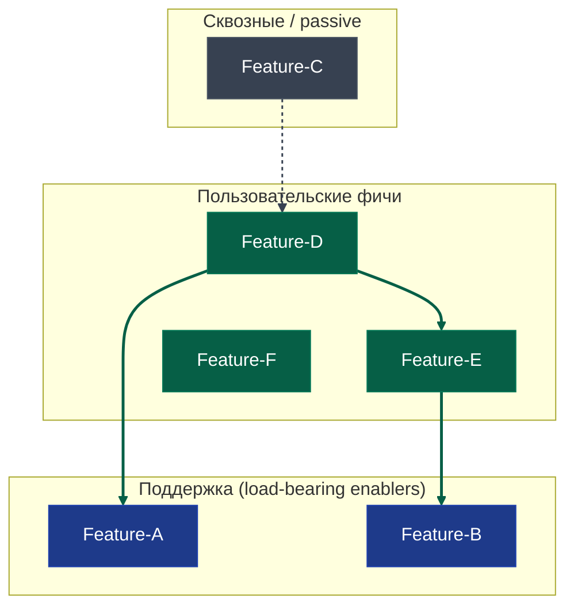

# <Название продукта>

[Метаданные: дата, статус (draft / signed / shipped), версия, автор.

Опциональное поле v0.6.0: `decomposition: skipped` — выставляется когда оператор явно отказался от decomposition phase per Entry A option 3 в Шаге 12.5. Маркер ставится только на `signed` спеке (на `shipped` запрещено per D18 frozen invariant). Existence маркера suppresses Entry B auto-prompt в session setup при последующих открытиях. Оператор может удалить маркер вручную для restore detection.]

## Содержание

- [1. Описание продукта](#1-описание-продукта)
- [2. Группы пользователей](#2-группы-пользователей)
- [3. Задачи пользователей](#3-задачи-пользователей)
- [4. Фичи и функции](#4-фичи-и-функции)
  - [Фича: <Name1>](#фича-name1)
  - [Фича: <Name2>](#фича-name2)
  - [Фича: <Name3>](#фича-name3)
- [5. Стратегические развилки](#5-стратегические-развилки)
- [6. Сквозные политики](#6-сквозные-политики)
- [7. Переиспользуемые подполитики](#7-переиспользуемые-подполитики)
- [8. Базовые требования к нагрузке и доступности](#8-базовые-требования-к-нагрузке-и-доступности)
- [9. Примерные сценарии работы](#9-примерные-сценарии-работы)
- [10. Ссылки на парковку](#10-ссылки-на-парковку)
- [11. Что может пойти не так](#11-что-может-пойти-не-так)
- [12. Открытые вопросы на момент закрытия сессии](#12-открытые-вопросы-на-момент-закрытия-сессии)

## 1. Описание продукта
[результат Шага 1]

- Что это — одна фраза
- Тип проекта (личный / стартап-MVP / open-source / внутренний инструмент / коммерческий)
- Заказчик ↔ пользователь (если различаются)
- Бизнес-цели заказчика (если коммерческий или внутренний)
- Гипотетические персоны с обоснованием (если стартап-MVP / open-source)

## 2. Группы пользователей
[результат Шага 2]

Список ролей. Per group — название, описание, основная цель использования продукта.

## 3. Задачи пользователей
[результат Шага 3]

- Multi-segment / коммерческий: matrix «группа × задачи».
- Single-segment / личный: линейный список задач.

## 4. Фичи и функции
[результат Шагов 4-6, сгруппировано по фичам]

**Mermaid-диаграмма зависимостей (mandatory, feature-level — historical naming «module-level» preserved как technical descriptor of granularity).** Ноды графа — фичи, связи — обобщения inter-feature dependencies, выведенные из поля `Зависит от` в карточках функций. Function-level Mermaid out (теряет обзорность при 30+ функциях). Pre-baked skeleton ниже — агент наполняет именами фич и связями, не изобретает структуру с нуля.



**Опциональное расщепление категории на под-группы** (если в продукте качественное различение политик / контрактов внутри одной категории — например, demo-продукт с wow / structure доменами, или B2B с двумя identity-системами). Пример фрагмента для Domain split:

```mermaid
    subgraph Domain ["Пользовательские фичи"]
        subgraph Wow ["Wow (продающие фичи)"]
            WM1["Feature-W1"]
            WM2["Feature-W2"]
        end
        subgraph Structure ["Structure (поддерживающие)"]
            SM1["Feature-S1"]
        end
    end

    classDef wowStyle fill:#065f46,stroke:#047857,color:#fff
    classDef structStyle fill:#0f766e,stroke:#14b8a6,color:#fff
    class WM1,WM2 wowStyle
    class SM1 structStyle
```

Hex для подгрупп: Infra (`#1e3a8a / #2563eb`), Passive (`#374151 / #6b7280`), Domain (`#065f46 / #0f766e`, третий `#16a34a`).

### Фича: <Name>

[1-2 строки краткого описания фичи — что делает в продукте, для кого, какую часть value proposition покрывает. Перед списком функций.]

#### F-<slug>-N. <Название функции>

**Тип:** пользовательская | поддерживающая
**Статус:** in-scope | parked | out-of-scope
**Назначение:** 1-2 строки, что делает для юзера.
**Входит:** что включаем в эту версию функции.
**Не входит (это отдельная функция):** ссылки на соседние F-...
**Не делаем вообще:** опционально, если есть явные out-of-scope cuts.
**Зависит от:** F-..., F-... (поддерживающие, от которых нужна работа)
**Доступно группам:** если Шаг 9 сработал и группы различаются.
**Inherits:** опционально — CC-X from <previous spec> (если standing policy применима, см. Шаг 7).

## 5. Стратегические развилки
[результат Сквозной проверки 3]

Cell-формат как у feature-spec, с явной фиксацией impact на состав функций.

### Sf1. <название> [decision: что решаем] [status: RESOLVED | OUT-OF-SCOPE]

(DEFERRED forks при closure уже мигрированы в backlog § Deferred forks, в spec'е после closure они не остаются — поэтому в `status` тут только RESOLVED или OUT-OF-SCOPE.)

**Resolution:** ответ + reasoning
**Branches [XOR | OR | OPT]:**
- Sf1.1 — <label> → impact: <какие функции добавляются / удаляются / меняют scope>
- Sf1.2 — <label> → impact: ...
**Связи:** ссылки на F-...
**Examples:** опциональные конкретные сценарии

(OPEN forks недопустимы при closure — должны быть либо RESOLVED, либо DEFERRED, либо OUT-OF-SCOPE.)

## 6. Сквозные политики
[результат Шагов 7, 8, 10 — только новые в этой итерации; standing policies из предыдущих spec'ов inherited через поле `Inherits` в карточках Section 4]

### CC1. <название>
**Применяется к:** F-..., F-... | всем функциям
**Resolution:** что именно правило диктует
**Pattern:** «Если <условие> → <действие>» — для жёстких политик

## 7. Переиспользуемые подполитики
[P-NAME-блоки если применимо — алгоритм / правило, на которое ссылаются ≥2 функции]

### P-<UPPER-CASE-WITH-DASHES>
[блок, описывающий поведение]
**Used in:** F-..., F-..., CC...

## 8. Базовые требования к нагрузке и доступности
[результат Шага 11, если применимо]

Только то, что осознанно выбрано как продуктовое решение.

## 9. Примерные сценарии работы
[опционально: включается если коммерческий / multi-segment контекст или явный запрос оператора]

### Сценарий: <название>
3-5 строк narrative с явными ссылками на F-...

## 10. Ссылки на парковку
[skill-generated при closure — навигационные pointers на backlog]

Из этой спеки в backlog перенесены:
- **F-comm-X** (auto-classification) → parked (level: detailed). См. `<product-slug>-product-backlog.md` § Parked features.
- **Sf-Y** (email vs email + TG) → deferred. См. backlog § Deferred forks.
- **F-Z** (mobile app native) → rejected. См. backlog § Out-of-scope.

Полные карточки и причины — в backlog. Эта секция — навигация.

## 11. Что может пойти не так
[результат завершающей проверки — premortem-сценарии и порождённые ими функции / развилки / границы]

## 12. Открытые вопросы на момент закрытия сессии
[skill-generated]

| ID | Тип | Описание | Likely blocker / nice-to-have / уточнить |
|----|-----|----------|------------------------------------------|
| F-X | OPEN flag в функции (Resolution не зафиксирован) | ... | likely blocker / nice-to-have |
| Sf-Y | DEFERRED fork (мигрирует в backlog) | ... | nice-to-have для следующих итераций |
